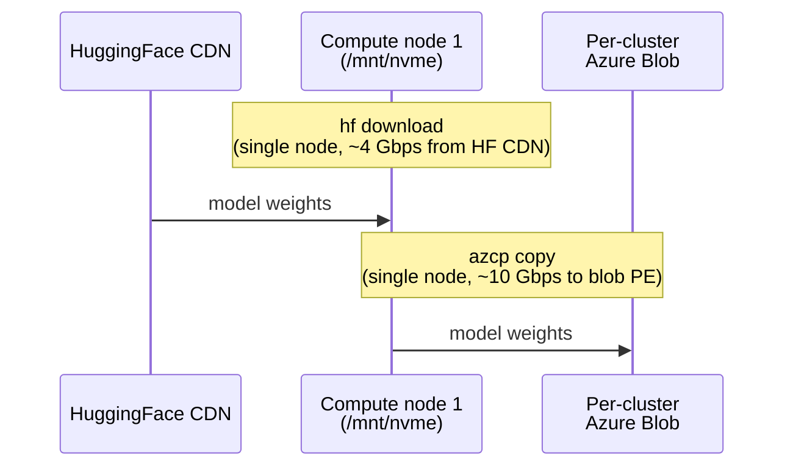
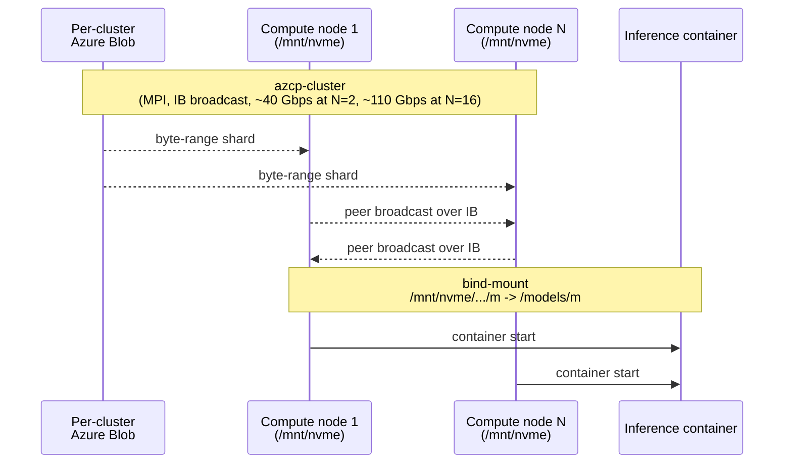

# azcluster

**Deploy production HPC/AI GPU clusters on Azure from a single Rust binary — Slurm *or* Kubernetes (AKS).** NDv5 H100/H200 with InfiniBand + NCCL + SHARP, containerised multi-node training and inference. One CLI invocation, ~15–20 minutes wall-clock, no laptop daemon and no `az` CLI.

> **Current release:** `v0.25.0`. See [CHANGELOG.md](CHANGELOG.md) for per-version history and [End-to-end walkthroughs](#end-to-end-walkthroughs) for live Slurm + AKS benchmark results on 2× ND H200.

## What it is

`azcluster` is a single Rust binary that deploys a production-style HPC/AI GPU cluster on Azure from scratch in 15–20 minutes — as either a **Slurm** cluster or a **Kubernetes (AKS)** cluster. You run it on your laptop; the cluster runs entirely on Azure. There is no laptop-side daemon, no control plane to maintain, and no Python/Node toolchain to install — the CLI authenticates to Azure directly via OAuth2 (PKCE in a browser or `--device-code` for headless) and calls ARM REST natively (no `az` CLI, and no `kubectl`/`kube-rs` for the AKS path).

### Two deployment targets

**Slurm** (`azcluster deploy`) — the default, a classic HPC scheduler:

- **Scheduler VM** running `slurmctld` + the per-cluster `azcluster-server` control daemon
- **Login VM** for interactive shells and job submission (Azure Bastion, or `--login-public-ip`)
- **Compute pools** (VMSS Flex) — any Azure VM SKU; defaults to `Standard_ND96isr_H100_v5`
- **Pyxis + Enroot** wired from boot, so containerised `srun --container-image=docker://nvcr.io/...` works the moment a node registers
- **Azure NetApp Files** at `/shared` (or scheduler-exported NFS for test mode)
- **LDAP multi-user** (slapd + SSSD, default `clusteradmin`/`clusteruser`) and **Slurm accounting** (Azure Database for MySQL Flexible Server)
- **Per-node `azhealthcheck`** draining misbehaving nodes every 5 min (see [`doc/healthchecks.md`](doc/healthchecks.md))

**AKS** (`azcluster deploy --target aks`) — managed Kubernetes:

- **AKS managed cluster** + a system pool + an **ND GPU agent pool** (driver lifecycle owned by the NVIDIA GPU Operator)
- **NVIDIA Network + GPU Operators** (MOFED/SR-IOV → `rdma/ib: 8` per node, DCGM), **Kueue**, **MPI-Operator**, **Training-Operator** — installed server-side via AKS `runCommand`, nothing on your laptop
- **Azure Container Storage** (`local-csi`, auto-RAID-0 of the node's local NVMe) + **blobcache** peer reads over InfiniBand (UCX/RDMA)
- **Native Kubernetes operate client** — `azcluster exec`/`logs`/`ssh`/`tunnel` talk to the API server directly over TLS + WebSocket (no laptop `kubectl`)

**Both targets share**: native ARM REST provisioning, IB + NCCL + SHARP tunings, a per-cluster **Azure Storage** account, a per-cluster **Azure Key Vault** (cluster manifest + admin SSH key, so any laptop with KV RBAC can operate the cluster), **Azure Monitor Workspace + Managed Grafana** with DCGM/InfiniBand dashboards, and the same runnable example workloads in [`examples/`](examples/) so Slurm-vs-AKS numbers differ only by orchestration/runtime.

## Why azcluster

- **Single binary, no laptop daemon.** Pure-Rust CLI, no `az` CLI dependency, no Python venv, no agent, no controller node. Authenticates to Azure directly; the AKS path drives Kubernetes over native TLS/WebSocket without `kubectl` or `kube-rs`.
- **AI-first defaults on both targets.** Default GPU pool is NDv5 H100/H200 with IB + NCCL tunings preconfigured (NCCL topology file, `mlx5_ib0..7` device list, SHARP enabled). Slurm wires Pyxis + Enroot from boot; AKS installs the NVIDIA Network + GPU Operators so `rdma/ib: 8` is allocatable per node.
- **Containerised multi-node training/inference works out of the box.** Slurm: cross-container PMIx world + enroot hooks, IB visible via `MELLANOX_VISIBLE_DEVICES=all`. AKS: MPIJob/PyTorchJob with the same IB fabric. Both validated end-to-end on 2-node ND H200 (NCCL ~483 GB/s, no TCP fallback).
- **Storage pipeline for big models.** Slurm uses `azcp` + `azcp-cluster` (HuggingFace → blob → MPI broadcast → per-node NVMe RAID-0). AKS uses Azure Container Storage + **blobcache peer reads over InfiniBand** — in one live run node-1 fetched its full 708.6 GB copy of DeepSeek-R1 100% over IB RDMA from node-0.
- **Same workloads, controlled comparison.** The NCCL / Megatron-Bridge training / vLLM / SGLang benchmarks ship as runnable files under [`examples/{slurm,aks}/`](examples/) with identical images, models, and parameters — so Slurm-vs-AKS numbers differ only by orchestration. See the [walkthroughs](#end-to-end-walkthroughs).
- **Managed observability out of the box.** Per-cluster Azure Monitor Workspace + Managed Grafana with DCGM (`PIPE_TENSOR_ACTIVE`, `SM_ACTIVE`, thermal/throttle, NVLink, ECC) and InfiniBand dashboards, populated from boot.
- **Stateless operator UX.** Cluster manifest + admin SSH key live in per-cluster Key Vault. Any laptop with `azcluster login` + KV RBAC can manage any cluster, Slurm or AKS.
- **Observable provisioning.** Every deploy captures per-resource ARM timings to `~/.config/azcluster/deployments/<cluster>/`. `azcluster timings` prints a sorted table and trends across runs.
- **Test mode that's actually fast.** Slurm `--shared-storage nfs-scheduler --no-monitoring --no-accounting` deploys a functional 1-CPU cluster in ~7 minutes.

## Install

Grab the prebuilt CLI from the latest release. Each release ships a versioned tarball plus a `SHA256SUMS` file:

```bash
VERSION=v0.25.0
ARCH=x86_64-linux                       # or aarch64-darwin
BASE=https://github.com/edwardsp/azcluster/releases/download/${VERSION}
curl -fsSLO "${BASE}/azcluster-cli-${VERSION}-${ARCH}.tar.gz"
curl -fsSLO "${BASE}/SHA256SUMS"
sha256sum --ignore-missing -c SHA256SUMS
tar -xzf "azcluster-cli-${VERSION}-${ARCH}.tar.gz"   # contains a top-level `azcluster`
sudo install -m 0755 azcluster /usr/local/bin/azcluster
azcluster --version
```

Or build from source: `cargo build --release --workspace` → `target/release/azcluster`. Building from source requires the Bicep CLI (`az bicep` or standalone `bicep`) to generate `bicep/main.json` and `bicep/aks-main.json` first — see [Development](#development). End users installing the prebuilt tarball need neither `az` nor Bicep.

### Prerequisites

- Azure subscription with permissions to create resource groups, role assignments, Monitor + Grafana resources, and Key Vaults
- SSH key (`~/.ssh/id_ed25519.pub` or `~/.ssh/id_rsa.pub`)
- `jq` (used by some example sbatches and the chart-generation script)

No `az` CLI install needed — `azcluster` authenticates to Azure directly via OAuth2.

```bash
azcluster login                              # interactive browser PKCE
azcluster login --device-code                # headless / SSH session
azcluster login --tenant <id> --subscription <id>
```

Tokens cache at `~/.azure/azcli_tokens.json` (mode 0600).

## Quickstart

### Slurm

Production-style deploy (ANF + monitoring + accounting + Bastion, no public IPs):

```bash
azcluster deploy --name demo \
  --pool name=gpu,sku=Standard_ND96isr_H100_v5,count=2,default \
  --bastion
```

~15 minutes ARM + ~10 s dashboard import. Then:

```bash
azcluster status demo                          # bootstrap probe, both nodes READY
azcluster ssh demo --user clusteradmin         # LDAP user, no operator setup
azcluster monitor demo                         # opens Grafana URL
azcluster timings demo                         # per-resource ARM timings
```

Submit a job from the cluster:

```bash
azcluster scp demo --user clusteradmin examples/slurm/nccl-allreduce.sbatch :/shared/home/clusteradmin/
azcluster exec demo --user clusteradmin -- "sbatch nccl-allreduce.sbatch"
# 16-rank NCCL all-reduce across 2 nodes in a NeMo container
```

### AKS

```bash
azcluster deploy --target aks --name demo \
  --location mexicocentral \
  --pool name=gpu,sku=Standard_ND96isr_H200_v5,count=2,default
```

~15–20 min (AKS + ND GPU pool + the operator stages). Then operate it with the same verbs — no laptop `kubectl`:

```bash
azcluster status demo                                       # node-pool + operator health
azcluster exec demo --host gpu-operator/<pod> -- nvidia-smi -L   # native K8s exec
azcluster ssh  demo --host aks-gpu-...-vmss000000           # host-root debug shell
azcluster kubeconfig demo                                    # fetch admin kubeconfig if you DO want kubectl
azcluster monitor demo                                       # opens Grafana URL
```

Run the matched 2-node NCCL benchmark (manifests are visible/runnable, not embedded):

```bash
azcluster kubeconfig demo --print > ~/.kube/demo.config && export KUBECONFIG=~/.kube/demo.config
NODES=2 NP=16 envsubst '${NODES} ${NP}' < examples/aks/nccl-allreduce-mpijob.yaml | kubectl apply -f -
```

### Tear down (either target)

```bash
azcluster delete demo                                        # releases GPU capacity quota immediately (async)
azcluster purge-kv --name demo --location <region> --yes     # hard-purge the soft-deleted Key Vault
```

See the [walkthroughs](#end-to-end-walkthroughs) for the full Slurm and AKS recipes (deploy → smoke → NCCL → training → vLLM → DeepSeek SGLang TP=16 → observability → tear-down).

## End-to-end walkthroughs

[`doc/walkthrough-plan.md`](doc/walkthrough-plan.md) is the canonical, version-agnostic recipe. Each release that completes a clean run gets a version-stamped walkthrough with per-GPU charts:

- **Slurm** — [`doc/full-walkthrough-slurm-v0.25.0.md`](doc/full-walkthrough-slurm-v0.25.0.md)
- **AKS** — [`doc/full-walkthrough-aks-v0.25.0.md`](doc/full-walkthrough-aks-v0.25.0.md)

Both were captured on the **same hardware, region, models, and parameters** (2× `Standard_ND96isr_H200_v5` / mexicocentral) so the only variable is the orchestration/runtime stack. Live results from the matched run:

| Benchmark | Slurm (`cmpsl8`) | AKS (`cmpaks8`) |
|---|---|---|
| NCCL all-reduce, containerized (16 ranks) | 483.26 GB/s | 482.94 GB/s |
| NCCL all-reduce, non-containerized (HPC-X) | 483.31 GB/s | — |
| Megatron-Bridge training, Llama-3.1-8B (16 GPU) | 515 TFLOP/s/GPU | 506 TFLOP/s/GPU |
| vLLM Llama-3.1-8B-FP8 | 9,880 tok/s | 9,839 tok/s |
| DeepSeek-R1-0528 SGLang TP=16 | 1,529 tok/s | 1,603 tok/s (with `ndv5-topo`) |

Every workload lands within run-to-run variance across the two stacks. The AKS walkthrough also includes a **blobcache-over-InfiniBand** graph: loading the 688 GB DeepSeek-R1 model, node-0 pulled the full copy from Blob while node-1 fetched its entire 708.6 GB copy **100% over IB RDMA** from node-0. (The walkthroughs also document why `NCCL_TOPO_FILE` is required for the latency-bound TP=16 decode — auto-set on Slurm via the HPC image, mounted via a ConfigMap on AKS.)

## Deploy options

### Common flags

| Flag | Default | Notes |
|---|---|---|
| `--target {slurm,aks}` | `slurm` | Deployment target: a Slurm cluster (default) or a managed Kubernetes (AKS) cluster |
| `--name <name>` | required | Cluster name; appears in RG name (`rg-azcluster-<name>`), VM names, KV name |
| `--location <region>` | required | Azure region for compute. Some regions don't host AMG — see `--grafana-location`. |
| `--grafana-location <region>` | `--location` | Use a different region for Managed Grafana (e.g. `southafricanorth` → `uksouth`) |
| `--resource-group <name>` | `rg-azcluster-<name>` | Override the auto-derived RG name |
| `--pool name=...,sku=...,count=N[,default]` | required, repeatable | Add a compute pool. The `default` pool's partition is the Slurm default. |
| `--scheduler-sku <sku>` | `Standard_D8as_v5` | Override scheduler VM SKU (useful when D-class capacity is tight in your region) |
| `--login-sku <sku>` | `Standard_D4as_v5` | Override login VM SKU |
| `--ubuntu {2204,2404}` | `2404` | Marketplace image series (`microsoft-dsvm:ubuntu-hpc`) |
| `--bastion` | off | Provision Azure Bastion Standard SKU + `enableTunneling`. `ssh`/`exec`/`tunnel`/`scp` auto-route through Bastion when login has no public IP. |
| `--login-public-ip` | off | Give the login VM a public IP (mutually exclusive with `--bastion` in practice) |
| `--allowed-ssh-cidrs <cidr,...>` | `0.0.0.0/0` | NSG allowlist when `--login-public-ip` is set |
| `--shared-storage {anf,nfs-scheduler}` | `anf` | `nfs-scheduler` exports `/shared` from the scheduler VM (SPOF, ~12 min faster, test only) |
| `--anf-size-tib N` | `2` | ANF volume size |
| `--anf-tier {Standard,Premium,Ultra}` | `Standard` | ANF service level |
| `--amlfs-size-tib N` | off | Provision Azure Managed Lustre at `/amlfs` |
| `--amlfs-sku <sku>` | — | e.g. `AMLFS-Durable-Premium-250` |
| `--amlfs-zone N` | — | Availability zone for AMLFS |
| `--no-monitoring` | off | Skip AMW + AMG (saves ~3 min) |
| `--no-accounting` | off | Skip MySQL Flexible Server + slurmdbd (saves ~5 min) |
| `--storage-public-access` | off | Allow public network access to the per-cluster Storage account (default: PE-only) |
| `--storage-hns` | off | ADLS Gen2 / hierarchical namespace on the Storage account |
| `--no-wait` | off | Submit ARM and return immediately. Run `azcluster resume --name <name>` later to wait + run post-deploy hooks. |
| `--azcluster-version vX.Y.Z` | current | Pin a specific release tag (cloud-init fetches the matching tarball from GitHub Releases) |
| `--extra-package <pkg>` | — | Repeatable. Extra apt packages installed on every node at boot. |

Most flags above configure the **Slurm** target. **AKS** (`--target aks`) uses the common subset — `--name`, `--location`, `--grafana-location`, `--pool`, `--no-monitoring`, and `--storage`/`--no-storage` (Azure Container Storage + per-cluster Blob, on by default) — and ignores Slurm-only flags (`--bastion`, `--shared-storage`, `--anf-*`, `--amlfs-*`, `--no-accounting`, `--scheduler-sku`, `--login-sku`).

### Deploy variants

**Production**, ANF + monitoring on, Bastion (no public IPs):

```bash
azcluster deploy --name demo \
  --location eastus --grafana-location eastus \
  --pool name=gpu,sku=Standard_ND96isr_H100_v5,count=2,default \
  --bastion
```

**AKS target** (managed Kubernetes + ND GPU pool + NVIDIA operators + Kueue/MPI/Training operators + storage):

```bash
azcluster deploy --target aks --name demo \
  --location mexicocentral \
  --pool name=gpu,sku=Standard_ND96isr_H200_v5,count=2,default
```

The AKS path registers the subscription InfiniBand feature, deploys the parallel `bicep/aks-main.json` template, and installs cert-manager, NVIDIA Network Operator, NVIDIA GPU Operator, Kueue, MPI-Operator, and Training-Operator via AKS `runCommand`. Operate it with the same verbs as Slurm — `azcluster exec/logs/ssh/tunnel` talk to the Kubernetes API directly (no laptop `kubectl`; `azcluster kubeconfig` fetches the admin kubeconfig if you want one). Monitoring is on by default: AKS managed Prometheus is linked to the per-cluster Azure Monitor Workspace, a DCGM ServiceMonitor scrapes `nvidia-dcgm-exporter`, and GPU/IB metrics are visible in Azure Managed Grafana; pass `--no-monitoring` to skip AMW/AMG and that scrape config. Workloads live under [`examples/aks/`](examples/aks/): run `nccl-allreduce-mpijob.yaml` with `envsubst ... | kubectl apply -f -` for the 2-node NCCL MPIJob, then install `training-operator.yaml`, create the `examples/megatron-pretrain.py` ConfigMap, and apply `training-megatron-pytorchjob.yaml` for the Llama-3.1-8B Megatron-Bridge benchmark. With `--storage` (on by default) the deploy also installs **Azure Container Storage** (`local-csi-driver`, an auto-RAID-0 of the node's local NVMe at StorageClass `local-csi`) and a per-cluster Blob account; the storage examples (azcp staging + **blobcache peer reads over InfiniBand** + a training-with-blobcache PyTorchJob) are also run with `kubectl`/`helm`, not embedded in the binary. `azcluster` provisions infrastructure only.

**Mixed CPU + GPU pools** (Slurm sees both partitions):

```bash
azcluster deploy --name demo \
  --pool name=cpu,sku=Standard_HB120rs_v3,count=2,default \
  --pool name=gpu,sku=Standard_ND96isr_H100_v5,count=2 \
  --bastion
```

**Rapid-test** (~7 min, test only — SPOF on scheduler-exported NFS):

```bash
azcluster deploy --name demo \
  --shared-storage nfs-scheduler --no-monitoring --no-accounting \
  --pool name=cpu,sku=Standard_D8as_v5,count=1,default \
  --login-public-ip
```

**Fire-and-forget** (return immediately after ARM submission, run hooks later):

```bash
azcluster deploy --name demo --no-wait \
  --pool name=gpu,sku=Standard_ND96isr_H100_v5,count=2,default --bastion
# ...go for coffee, terminal can die...
azcluster status demo                  # check ARM progress + cloud-init log
azcluster resume --name demo           # waits for ARM, runs post-deploy hooks
```

## Operator commands

| Command | Purpose |
|---|---|
| `azcluster login [--device-code] [--tenant <id>] [--subscription <id>]` | OAuth2 to Azure; caches token |
| `azcluster list` | Discover all azcluster-managed clusters in the current subscription (via RG tags) |
| `azcluster deploy …` | Provision a cluster |
| `azcluster resume --name <name>` | Wait for a `--no-wait` or interrupted deploy to finish + run post-deploy hooks |
| `azcluster status <name>` | Pool capacities + bootstrap probe (READY/in-progress) for login + scheduler |
| `azcluster scale <name> <pool> <count>` | Resize a pool to an absolute node count: `azcluster scale demo gpu 2` |
| `azcluster ssh <name> [--scheduler\|--host <node>] [--user <ldap>]` | Interactive shell. **AKS**: `--host <nodeName>` opens a privileged node-root debug shell via the Kubernetes API. |
| `azcluster scp <name> <SRC>... <DST>` | Bastion-aware scp (remote paths: `[node]:path`, empty node = login) |
| `azcluster exec <name> [--scheduler\|--host <node>] [--user <ldap>] [-A] -- <cmd>` | One-shot command. **AKS**: `--host [namespace/]pod -- <cmd>` runs native Kubernetes exec (no local kubectl); omit `<cmd>` for `/bin/sh`. |
| `azcluster tunnel <name> <local:remote>` | Local TCP forward through login. **AKS**: `--host [namespace/]pod --local-port <local> --remote-port <podPort>` forwards to an arbitrary pod port via the Kubernetes API. |
| `azcluster kubeconfig <name> [--path P] [--print]` | AKS only: fetch the cluster-admin kubeconfig to `~/.azcluster/kube/<name>.config` for local `kubectl` |
| `azcluster logs <name> --component {scheduler\|login\|<node>} [--tail N\|--follow]` | Tail `/var/log/azcluster/install.log` or `journalctl`. **AKS**: `--component [namespace/]pod` streams native Kubernetes pod logs. |
| `azcluster monitor <name>` | Print the AMG Grafana URL |
| `azcluster timings <name> [--last N] [--trend]` | Per-resource deploy times; sorted table or trend TSV |
| `azcluster delete <name>` | Delete the resource group (async) |
| `azcluster purge-kv [--name <n>\|--all] [--location <loc>]` | Hard-purge soft-deleted azcluster Key Vaults |
| `azcluster user add <name> --username <u> [--ssh-key <path>] [--admin]` | Create LDAP user (auto-allocated UID, home `/shared/home/<u>`) |
| `azcluster user remove <name> --username <u>` | Delete LDAP user |
| `azcluster user list <name>` | List LDAP users |
| `azcluster user setadmin/unsetadmin <name> --username <u>` | Promote/demote existing user |
| `azcluster user sshkey {add,remove,list} <name> --username <u>` | Manage `sshPublicKey` LDAP attribute |

### First multi-user setup

```bash
# Add an LDAP user with your local pubkey
azcluster user add demo --username alice --ssh-key ~/.ssh/id_rsa.pub

# SSH straight in
azcluster ssh demo --user alice                              # → login VM
azcluster ssh demo --host demo-gpu-0001 --user alice         # → compute via ProxyJump

# Submit jobs as alice
azcluster scp demo --user alice examples/slurm/nccl-allreduce.sbatch :/shared/home/alice/
azcluster ssh demo --user alice -- sbatch nccl-allreduce.sbatch
```

Notes:
- `--host <name>` and `--scheduler` are mutually exclusive. `--host` works for any in-VNet hostname the login VM can resolve.
- `--user <ldap-user>` is honored at every SSH hop so the same identity authenticates ProxyJump and final destination.
- `--scheduler --user <ldap-user>` does NOT work — the scheduler hosts the LDAP server itself and runs no SSSD client. Use the admin user for scheduler shell access; submit jobs from login.
- `azcluster exec -A` opts into SSH agent forwarding when you need nested ssh from the remote shell.

## Architecture

### Slurm target


**Network plan** (VNet `10.42.0.0/16`):

| Subnet | CIDR | First usable | Workload |
|---|---|---|---|
| `scheduler` | `10.42.1.0/24` | `10.42.1.4` | scheduler VM + control plane (`8443`, `6817`) |
| `login` | `10.42.2.0/24` | `10.42.2.4` | login VM |
| `amlfs` | `10.42.3.0/24` | — | optional Lustre MGS/MDS/OST |
| `compute` | `10.42.4.0/22` | `10.42.4.4` | VMSS Flex compute nodes (all pools) |
| `anf` | `10.42.0.0/26` | — | ANF delegated subnet |
| `database` | `10.42.8.0/29` | — | MySQL Flexible Server (when accounting on) |
| `AzureBastionSubnet` | `10.42.0.64/26` | — | Bastion (when `--bastion`) |

**Identity & RBAC** (cluster scope):

- A `uai-<cluster>-scheduler` user-assigned managed identity is attached to scheduler + login + compute VMSS.
- The UAI gets `Storage Blob Data Contributor` on the per-cluster Storage account (used by `azcp` from compute via IMDS).
- When monitoring is on, the UAI gets `Monitoring Metrics Publisher` on the AMW's default Data Collection Rule.
- The deployer principal gets `Grafana Admin` on AMG (so the CLI can `POST /api/dashboards/db`) and `Key Vault Secrets Officer` on the per-cluster KV.

**Distribution**: CI builds release artifacts on tag (`v*`): `azcluster-cli-{x86_64-linux,aarch64-darwin}`, `azcluster-server-x86_64-linux`, `spank_pyxis-vX.Y.Z-x86_64-linux.so`, `azhealthcheck-x86_64-linux`, versioned tarball, `SHA256SUMS`. Cloud-init on each node fetches the tarball from GitHub Releases, verifies SHA256, and starts the relevant systemd unit.

### AKS target

The AKS path uses a parallel Bicep tree (`aks-main.bicep` → `aks-cluster.bicep` → `modules/aks.bicep`) — kept entirely separate from the Slurm `main.bicep` so the live-validated Slurm path is untouched.

- **Control plane**: an AKS managed cluster (public API server) in the same per-cluster VNet, with a system node pool and an **ND GPU agent pool** (`gpuProfile.driver: None` — the NVIDIA GPU Operator owns the driver). The InfiniBand fabric is exposed once the subscription `AKSInfinibandSupport` feature is registered (the CLI does this pre-gate).
- **Operators** (installed server-side via AKS `runCommand`, embedded manifests/Helm values in the binary): cert-manager → NVIDIA Network Operator (MOFED/SR-IOV → `rdma/ib: 8` per node) → NVIDIA GPU Operator (drivers + DCGM) → Kueue → MPI-Operator → Training-Operator → Azure Container Storage `local-csi`.
- **Identity**: the AKS **kubelet managed identity** holds `Storage Blob Data Contributor` on the per-cluster Blob account; in-pod workloads select it via IMDS (`AZURE_CLIENT_ID`).
- **Monitoring**: AKS managed Prometheus (ama-metrics addon) → the per-cluster AMW via a DCE/DCR/DCRA chain, with a DCGM ServiceMonitor (`azmonitoring.coreos.com/v1`) scraping `nvidia-dcgm-exporter`.
- **Operate plane**: `azcluster exec/logs/ssh/tunnel` reach the API server directly over client-cert TLS + WebSocket (`v5.channel.k8s.io` for exec/attach) — no laptop `kubectl`, and no `kube-rs`/`k8s-openapi` dependency (the workspace is pinned below their MSRV).

The per-cluster **Key Vault** and **Azure Monitor Workspace + Managed Grafana** are shared with the Slurm path (same provisioning + discovery-tag model).

## Storage pipeline for big models

Big datasets and model weights follow a two-phase canonical path. Phase 1 happens **once per model**: download from HuggingFace to NVMe, upload to the per-cluster blob. Phase 2 happens **every time you start a job**: broadcast from blob across all compute nodes in parallel over IB, then bind-mount into the container. The model persists in blob for the lifetime of the cluster, so phase 2 is the fast path — phase 1 is amortised.

Runnable Slurm examples ship in the repo under [`examples/slurm/`](examples/slurm/); copy them to `/shared/home/<user>/` with `azcluster scp` before submitting.

### Phase 1 — one-time ingest (per model)



After this, the model is in blob and stays there for the cluster's lifetime. Skip to phase 2 for any subsequent run.

### Phase 2 — every job (fast path)



### Measured numbers

On a 2-node `Standard_ND96isr_H100_v5` cluster:

| Model | Phase 1 (HF + upload, once) | Phase 2 (broadcast, per run) |
|---|---|---|
| Llama-3.1-8B-FP8 (8.5 GB) | 25 s + 9 s = 34 s | 3.6 s (20 Gbps) |
| DeepSeek-R1-0528 FP8 (642 GiB) | 21 min + 9 min = 30 min | 134 s (41 Gbps) |

Phase 2 scales near-linearly with node count above 2: 2 nodes is the worst case for `azcp-cluster` because each rank must read ~50% of the bytes from local NVMe while concurrently writing the other ~50%. At 16 nodes each rank reads ~6% and writes ~94%, and the upstream tuning doc measures 110 Gbps.

## Observability

Four Grafana dashboards land in an `azcluster` folder, populated from the first minute:

- **Node Health** — CPU, memory, disk, network from `node_exporter` on every VM
- **Slurm Scheduler** — queue, partition state, jobs by state (from `prometheus-slurm-exporter` on the scheduler)
- **GPU + InfiniBand** — DCGM (util, memory, clocks, power, temperature, tlimit, throttle reasons, `SM_ACTIVE`, `PIPE_TENSOR_ACTIVE`, NVLink errors, ECC) + `node_infiniband_port_*` per-port rates
- **Node Health Checks** — per-node/per-check status from `azhealthcheck` (runs every 5 min via Slurm `HealthCheckProgram`; non-zero exit drains the node). See [`doc/healthchecks.md`](doc/healthchecks.md) for the check list, severity model, and Prometheus metrics surface.

Open the URL via `azcluster monitor <name>`. The same PromQL works in Grafana's Explore view — useful queries:

```promql
# Per-node max GPU die temp (spot the one-hot-GPU-among-N pattern)
max by (nodename) (DCGM_FI_DEV_GPU_TEMP)

# Aggregate IB receive Gbps per node (sum across 8 NICs)
sum by (nodename) (rate(node_infiniband_port_data_received_bytes_total[1m])) * 8 / 1e9

# Tensor-core utilization per GPU
DCGM_FI_PROF_PIPE_TENSOR_ACTIVE

# Thermal throttle rate (ns/s); non-zero means HW thermal kicked in
rate(DCGM_FI_DEV_THERMAL_VIOLATION[1m])
```

`nodename` is the right disambiguator across the fleet. Don't filter by `instance` — each node scrapes its own colocated Prometheus on `127.0.0.1:9100` so the `instance` label is identical across all nodes.

## Repo layout

```
crates/
  azcluster-core/       domain model (Cluster, NodePool, NodeSku, …)
  azcluster-cli/        management CLI (clap) — operator binary
  azcluster-server/     control-plane daemon (axum) on scheduler VM
  azhealthcheck/        per-node health probe binary
bicep/
  main.bicep            subscription-scope entry, creates RG
  cluster.bicep         orchestrates per-cluster modules
  aks-main.bicep        subscription-scope AKS target entry, creates RG
  aks-cluster.bicep     AKS target orchestrator (AKS + VNet + KV)
  modules/              network, scheduler, login, compute, anf, amlfs,
                        accounting, monitoring, keyvault, storage, bastion, aks
  main.json             ARM template embedded into the CLI binary (generated from main.bicep; not committed)
  aks-main.json         AKS target ARM template embedded into the CLI binary (generated from aks-main.bicep; not committed)
cloud-init/
  scheduler.yaml.tmpl   slurmctld, slurmdbd, slapd LDAP, prometheus, NFS exports (test mode)
  login.yaml.tmpl       mounts /shared + /amlfs; slurm client + Pyxis + SSSD
  compute.yaml.tmpl     slurmd, Pyxis, Enroot, NCCL+IB tunings, dcgm-exporter, NVMe RAID-0
grafana/dashboards/     node, slurm, gpu+ib, health (auto-imported post-deploy)
examples/
  slurm/                 runnable Slurm sbatch workloads (NCCL, training, inference)
  aks/                   runnable AKS manifests (NCCL, training, inference, storage)
doc/
  walkthrough-plan.md                  canonical version-agnostic walkthrough
  full-walkthrough-slurm-v0.25.0.md    latest Slurm live run (2x ND H200) + charts
  full-walkthrough-slurm-v0.25.0/      per-GPU charts for the Slurm run
  full-walkthrough-aks-v0.25.0.md      latest AKS live run (2x ND H200) + charts
  full-walkthrough-aks-v0.25.0/        per-GPU charts + blobcache-over-IB graph
  full-walkthrough-slurm-v0.24.20.md   historical v0.24.20 Slurm run
  healthchecks.md                      operator-facing health check reference
.github/workflows/      ci.yml + release.yml
research/               local reference checkouts (gitignored)
.sisyphus/              planning artifacts (gitignored)
CHANGELOG.md            per-version history
AGENTS.md               operating manual for AI agents
```

## Development

```bash
# Generate the ARM template first — the CLI build embeds it via include_str!
# and fails with instructions if it is missing.
az bicep build --file bicep/main.bicep --outfile bicep/main.json
az bicep build --file bicep/aks-main.bicep --outfile bicep/aks-main.json

cargo build --workspace
cargo test --workspace
cargo clippy --workspace --all-targets -- -D warnings
for f in bicep/main.bicep bicep/cluster.bicep bicep/aks-main.bicep bicep/aks-cluster.bicep bicep/modules/*.bicep; do
  az bicep build --file "$f" --stdout > /dev/null
done
```

`bicep/main.json` and `bicep/aks-main.json` are **generated, not committed** (they're gitignored). The CLI's `build.rs` checks both at compile time and fails with actionable instructions if either is absent, so anyone building from source must run the matching `az bicep build --file ... --outfile ...` command after editing Slurm or AKS Bicep. CI and the release pipeline regenerate templates from a pinned Bicep version on every run. End users who install the prebuilt tarball never need `az` or Bicep — generated templates are already baked into published binaries when their CLI path uses them.

## Releasing

Tag-triggered. `CHANGELOG.md` follows [Keep a Changelog](https://keepachangelog.com/en/1.1.0/). To release:

1. Land all `Unreleased` work; verify `cargo fmt && cargo clippy -- -D warnings && cargo test --workspace` and every Bicep file builds cleanly.
2. Edit `CHANGELOG.md`: rename `## [Unreleased]` → `## [X.Y.Z] - YYYY-MM-DD`; add a fresh empty `## [Unreleased]` block at the top.
3. Bump version in `Cargo.toml` and the `--azcluster-version` CLI default in `crates/azcluster-cli/src/main.rs`.
4. Commit, `git tag vX.Y.Z && git push origin main --tags` — CI builds and publishes the release.

## Roadmap

Tracked on the [GitHub issue tracker](https://github.com/edwardsp/azcluster/issues). Feature requests, bug reports, and design discussions all live there. See [CHANGELOG.md](CHANGELOG.md) for what's already shipped.

## License

TBD.
