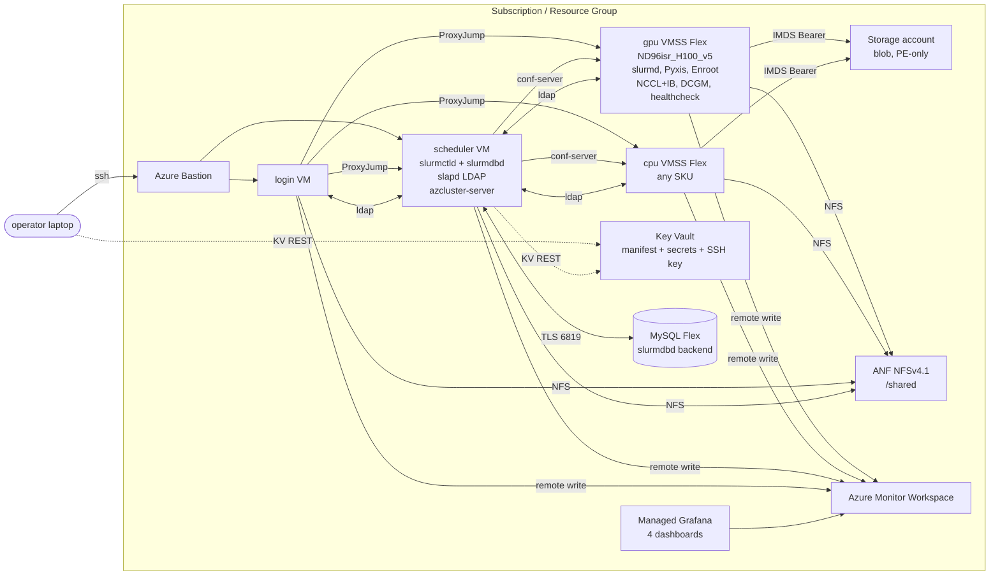
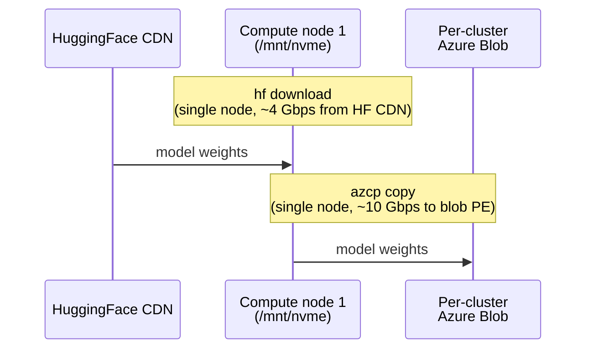
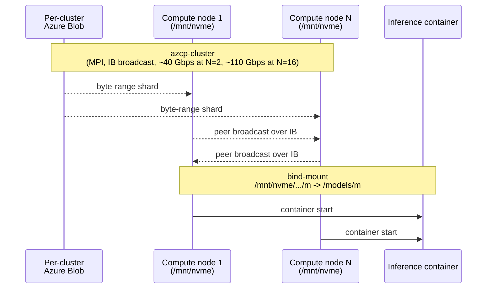

# azcluster

**Fast Rust-based Slurm cluster deployer for Azure.** Slurm + Pyxis + Enroot for containerised AI workloads on NDv5 H100. One CLI invocation, ~15 minutes wall-clock, no daemons on your laptop.

> **Current release:** `v0.24.12`. See [CHANGELOG.md](CHANGELOG.md) for per-version history.
>
> **End-to-end walkthrough:** [`doc/full-walkthrough-plan.md`](doc/full-walkthrough-plan.md) (canonical, version-agnostic) and [`doc/full-walkthrough-v0.24.12.md`](doc/full-walkthrough-v0.24.12.md) (latest live results: NCCL plain VM 461.6 GB/s, NeMo container multinode 428.0 GB/s, Llama-3.1-8B-FP8 vLLM 10,118 tok/s @ 12.06 ms TPOT, DeepSeek-R1-0528 SGLang TP=16 491.8 tok/s @ 122.6 ms TPOT).

## What it is

`azcluster` is a single Rust binary that deploys a production-style HPC/AI Slurm cluster on Azure from scratch in under 20 minutes. You run it on your laptop; the cluster runs entirely on Azure. There is no laptop-side daemon, no control plane to maintain, and no Python/Node toolchain to install — the CLI authenticates to Azure directly via OAuth2 (PKCE in a browser or `--device-code` for headless) and calls ARM REST natively.

A deployed cluster has:

- **Scheduler VM** running `slurmctld` + the per-cluster `azcluster-server` control daemon
- **Login VM** for interactive shells and job submission (no public IP by default; reach it via Azure Bastion)
- **One or more compute pools** (VMSS Flex) — pick any Azure VM SKU; defaults target `Standard_ND96isr_H100_v5` for AI work
- **Per-cluster Azure Storage account** (StorageV2 + Private Endpoint) for blob-staged datasets and model weights
- **Azure NetApp Files** mounted at `/shared` (default) or scheduler-exported NFS for test mode
- **Azure Monitor Workspace + Managed Grafana** with four auto-imported dashboards (Node Health, Slurm Scheduler, GPU + InfiniBand, Health Checks)
- **Per-cluster Azure Key Vault** holding the cluster manifest and admin SSH keypair so any operator with KV RBAC can run commands from a fresh laptop
- **LDAP-backed multi-user setup** (slapd on scheduler, SSSD on login + compute) with two default users (`clusteradmin` + `clusteruser`) provisioned at deploy time
- **Slurm accounting** via Azure Database for MySQL Flexible Server
- **Per-node `azhealthcheck`** running every 5 minutes via Slurm `HealthCheckProgram` to drain misbehaving nodes automatically (see [`doc/healthchecks.md`](doc/healthchecks.md))

## Why azcluster

- **Single binary, no laptop daemon.** Pure-Rust CLI, no `az` CLI dependency, no Python venv, no agent, no controller node. Authenticates to Azure directly.
- **AI-first defaults.** Default GPU pool is NDv5 H100 with IB + NCCL tunings preconfigured (NCCL topology file, `mlx5_ib0..7` device list, SHARP enabled). Pyxis + Enroot wired from boot so `srun --container-image=docker://nvcr.io/...` works the moment a node registers.
- **Multi-pool, dynamic Slurm.** One VMSS Flex per pool. Nodes self-register via `slurmd --conf-server`; `slurm.conf` uses `NodeSet+PartitionName` so CPU and GPU partitions can coexist with hot reconfiguration.
- **Containerised multi-node MPI works out of the box.** Cross-container PMIx world (slurmd env + enroot hooks), IB devices visible inside the container via `MELLANOX_VISIBLE_DEVICES=all` — validated end-to-end on 2-node H100 NeMo containers.
- **Storage pipeline for big models.** Per-cluster blob + `azcp` + `azcp-cluster` for HuggingFace → blob → MPI broadcast → per-node NVMe RAID-0. 642 GiB DeepSeek-R1 distributed across 2 nodes in 134 s at 41 Gbps.
- **Managed observability out of the box.** Four Grafana dashboards live in an `azcluster` folder, populated from boot. DCGM metrics include `PIPE_TENSOR_ACTIVE`, `SM_ACTIVE`, thermal limits, throttle reasons, NVLink errors, and ECC.
- **Stateless operator UX.** Cluster manifest + admin SSH key live in per-cluster Key Vault. Any laptop with `azcluster login` + KV RBAC can manage any cluster.
- **Observable provisioning.** Every deploy captures per-resource ARM timings to `~/.config/azcluster/deployments/<cluster>/`. `azcluster timings` prints a sorted table and trends across runs.
- **Test mode that's actually fast.** `--shared-storage nfs-scheduler --no-monitoring --no-accounting` deploys a functional 1-CPU cluster in ~7 minutes.

## Install

Grab the prebuilt CLI from the latest release. Each release ships a versioned tarball plus a `SHA256SUMS` file:

```bash
VERSION=v0.24.12
ARCH=x86_64-linux                       # or aarch64-darwin
BASE=https://github.com/edwardsp/azcluster/releases/download/${VERSION}
curl -fsSLO "${BASE}/azcluster-cli-${VERSION}-${ARCH}.tar.gz"
curl -fsSLO "${BASE}/SHA256SUMS"
sha256sum --ignore-missing -c SHA256SUMS
tar -xzf "azcluster-cli-${VERSION}-${ARCH}.tar.gz"   # contains a top-level `azcluster`
sudo install -m 0755 azcluster /usr/local/bin/azcluster
azcluster --version
```

Or build from source: `cargo build --release --workspace` → `target/release/azcluster`.

### Prerequisites

- Azure subscription with permissions to create resource groups, role assignments, Monitor + Grafana resources, and Key Vaults
- SSH key (`~/.ssh/id_ed25519.pub` or `~/.ssh/id_rsa.pub`)
- `jq` (used by some example sbatches and the chart-generation script)

No `az` CLI install needed — `azcluster` authenticates to Azure directly via OAuth2.

```bash
azcluster login                              # interactive browser PKCE
azcluster login --device-code                # headless / SSH session
azcluster login --tenant <id> --subscription <id>
```

Tokens cache at `~/.azure/azcli_tokens.json` (mode 0600).

## Quickstart

Production-style deploy (ANF + monitoring + accounting + Bastion, no public IPs):

```bash
azcluster deploy --name demo \
  --pool name=gpu,sku=Standard_ND96isr_H100_v5,count=2,default \
  --bastion
```

~15 minutes ARM + ~10 s dashboard import. Then:

```bash
azcluster status demo                          # bootstrap probe, both nodes READY
azcluster ssh demo --user clusteradmin         # LDAP user, no operator setup
azcluster monitor demo                         # opens Grafana URL
azcluster timings demo                         # per-resource ARM timings
```

Submit a job from the cluster:

```bash
azcluster exec demo --user clusteradmin -- "sbatch /shared/examples/dgxc-nemo-multinode-smoke.sbatch"
# 16-rank NCCL all-reduce across 2 nodes in a NeMo container, ~430 GB/s avg busbw
```

Tear down (releases H100 capacity quota immediately):

```bash
azcluster delete demo
```

See [`doc/full-walkthrough-plan.md`](doc/full-walkthrough-plan.md) for the full end-to-end recipe (deploy → smoke → NCCL → containerised NCCL multi-node → Llama-FP8 vLLM inference → DeepSeek-R1-0528 SGLang TP=16 inference → observability → tear-down), with every sbatch script inlined and the chart-generation appendix.

## Deploy options

### Common flags

| Flag | Default | Notes |
|---|---|---|
| `--name <name>` | required | Cluster name; appears in RG name (`rg-azcluster-<name>`), VM names, KV name |
| `--location <region>` | required | Azure region for compute. Some regions don't host AMG — see `--grafana-location`. |
| `--grafana-location <region>` | `--location` | Use a different region for Managed Grafana (e.g. `southafricanorth` → `uksouth`) |
| `--resource-group <name>` | `rg-azcluster-<name>` | Override the auto-derived RG name |
| `--pool name=...,sku=...,count=N[,default]` | required, repeatable | Add a compute pool. The `default` pool's partition is the Slurm default. |
| `--scheduler-sku <sku>` | `Standard_D8as_v5` | Override scheduler VM SKU (useful when D-class capacity is tight in your region) |
| `--login-sku <sku>` | `Standard_D4as_v5` | Override login VM SKU |
| `--ubuntu {2204,2404}` | `2404` | Marketplace image series (`microsoft-dsvm:ubuntu-hpc`) |
| `--bastion` | off | Provision Azure Bastion Standard SKU + `enableTunneling`. `ssh`/`exec`/`tunnel`/`scp` auto-route through Bastion when login has no public IP. |
| `--login-public-ip` | off | Give the login VM a public IP (mutually exclusive with `--bastion` in practice) |
| `--allowed-ssh-cidrs <cidr,...>` | `0.0.0.0/0` | NSG allowlist when `--login-public-ip` is set |
| `--shared-storage {anf,nfs-scheduler}` | `anf` | `nfs-scheduler` exports `/shared` from the scheduler VM (SPOF, ~12 min faster, test only) |
| `--anf-size-tib N` | `2` | ANF volume size |
| `--anf-tier {Standard,Premium,Ultra}` | `Standard` | ANF service level |
| `--amlfs-size-tib N` | off | Provision Azure Managed Lustre at `/amlfs` |
| `--amlfs-sku <sku>` | — | e.g. `AMLFS-Durable-Premium-250` |
| `--amlfs-zone N` | — | Availability zone for AMLFS |
| `--no-monitoring` | off | Skip AMW + AMG (saves ~3 min) |
| `--no-accounting` | off | Skip MySQL Flexible Server + slurmdbd (saves ~5 min) |
| `--storage-public-access` | off | Allow public network access to the per-cluster Storage account (default: PE-only) |
| `--storage-hns` | off | ADLS Gen2 / hierarchical namespace on the Storage account |
| `--no-wait` | off | Submit ARM and return immediately. Run `azcluster resume --name <name>` later to wait + run post-deploy hooks. |
| `--azcluster-version vX.Y.Z` | current | Pin a specific release tag (cloud-init fetches the matching tarball from GitHub Releases) |
| `--extra-package <pkg>` | — | Repeatable. Extra apt packages installed on every node at boot. |

### Deploy variants

**Production**, ANF + monitoring on, Bastion (no public IPs):

```bash
azcluster deploy --name demo \
  --location eastus --grafana-location eastus \
  --pool name=gpu,sku=Standard_ND96isr_H100_v5,count=2,default \
  --bastion
```

**Mixed CPU + GPU pools** (Slurm sees both partitions):

```bash
azcluster deploy --name demo \
  --pool name=cpu,sku=Standard_HB120rs_v3,count=2,default \
  --pool name=gpu,sku=Standard_ND96isr_H100_v5,count=2 \
  --bastion
```

**Rapid-test** (~7 min, test only — SPOF on scheduler-exported NFS):

```bash
azcluster deploy --name demo \
  --shared-storage nfs-scheduler --no-monitoring --no-accounting \
  --pool name=cpu,sku=Standard_D8as_v5,count=1,default \
  --login-public-ip
```

**Fire-and-forget** (return immediately after ARM submission, run hooks later):

```bash
azcluster deploy --name demo --no-wait \
  --pool name=gpu,sku=Standard_ND96isr_H100_v5,count=2,default --bastion
# ...go for coffee, terminal can die...
azcluster status demo                  # check ARM progress + cloud-init log
azcluster resume --name demo           # waits for ARM, runs post-deploy hooks
```

## Operator commands

| Command | Purpose |
|---|---|
| `azcluster login [--device-code] [--tenant <id>] [--subscription <id>]` | OAuth2 to Azure; caches token |
| `azcluster list` | Discover all azcluster-managed clusters in the current subscription (via RG tags) |
| `azcluster deploy …` | Provision a cluster |
| `azcluster resume --name <name>` | Wait for a `--no-wait` or interrupted deploy to finish + run post-deploy hooks |
| `azcluster status <name>` | Pool capacities + bootstrap probe (READY/in-progress) for login + scheduler |
| `azcluster scale <name> <pool> <count>` | Resize a pool to an absolute node count: `azcluster scale demo gpu 2` |
| `azcluster ssh <name> [--scheduler\|--host <node>] [--user <ldap>]` | Interactive shell |
| `azcluster scp <name> <SRC>... <DST>` | Bastion-aware scp (remote paths: `[node]:path`, empty node = login) |
| `azcluster exec <name> [--scheduler\|--host <node>] [--user <ldap>] [-A] -- <cmd>` | One-shot command |
| `azcluster tunnel <name> <local:remote>` | Local TCP forward through login |
| `azcluster validate <name> [--gpu] [--multi-node]` | `sinfo` + `srun hostname` + Pyxis import + (optionally) 2-node NCCL all-reduce |
| `azcluster logs <name> --component {scheduler\|login\|<node>} [--tail N\|--follow]` | Tail `/var/log/azcluster/install.log` or `journalctl` |
| `azcluster monitor <name>` | Print the AMG Grafana URL |
| `azcluster timings <name> [--last N] [--trend]` | Per-resource deploy times; sorted table or trend TSV |
| `azcluster delete <name>` | Delete the resource group (async) |
| `azcluster purge-kv [--name <n>\|--all] [--location <loc>]` | Hard-purge soft-deleted azcluster Key Vaults |
| `azcluster user add <name> --username <u> [--ssh-key <path>] [--admin]` | Create LDAP user (auto-allocated UID, home `/shared/home/<u>`) |
| `azcluster user remove <name> --username <u>` | Delete LDAP user |
| `azcluster user list <name>` | List LDAP users |
| `azcluster user setadmin/unsetadmin <name> --username <u>` | Promote/demote existing user |
| `azcluster user sshkey {add,remove,list} <name> --username <u>` | Manage `sshPublicKey` LDAP attribute |

### First multi-user setup

```bash
# Add an LDAP user with your local pubkey
azcluster user add demo --username alice --ssh-key ~/.ssh/id_rsa.pub

# SSH straight in
azcluster ssh demo --user alice                              # → login VM
azcluster ssh demo --host demo-gpu-0001 --user alice         # → compute via ProxyJump

# Submit jobs as alice
azcluster ssh demo --user alice -- sbatch /shared/examples/dgxc-nemo-multinode-smoke.sbatch
```

Notes:
- `--host <name>` and `--scheduler` are mutually exclusive. `--host` works for any in-VNet hostname the login VM can resolve.
- `--user <ldap-user>` is honored at every SSH hop so the same identity authenticates ProxyJump and final destination.
- `--scheduler --user <ldap-user>` does NOT work — the scheduler hosts the LDAP server itself and runs no SSSD client. Use the admin user for scheduler shell access; submit jobs from login.
- `azcluster exec -A` opts into SSH agent forwarding when you need nested ssh from the remote shell.

## Architecture



**Network plan** (VNet `10.42.0.0/16`):

| Subnet | CIDR | First usable | Workload |
|---|---|---|---|
| `scheduler` | `10.42.1.0/24` | `10.42.1.4` | scheduler VM + control plane (`8443`, `6817`) |
| `login` | `10.42.2.0/24` | `10.42.2.4` | login VM |
| `amlfs` | `10.42.3.0/24` | — | optional Lustre MGS/MDS/OST |
| `compute` | `10.42.4.0/22` | `10.42.4.4` | VMSS Flex compute nodes (all pools) |
| `anf` | `10.42.0.0/26` | — | ANF delegated subnet |
| `database` | `10.42.8.0/29` | — | MySQL Flexible Server (when accounting on) |
| `AzureBastionSubnet` | `10.42.0.64/26` | — | Bastion (when `--bastion`) |

**Identity & RBAC** (cluster scope):

- A `uai-<cluster>-scheduler` user-assigned managed identity is attached to scheduler + login + compute VMSS.
- The UAI gets `Storage Blob Data Contributor` on the per-cluster Storage account (used by `azcp` from compute via IMDS).
- When monitoring is on, the UAI gets `Monitoring Metrics Publisher` on the AMW's default Data Collection Rule.
- The deployer principal gets `Grafana Admin` on AMG (so the CLI can `POST /api/dashboards/db`) and `Key Vault Secrets Officer` on the per-cluster KV.

**Distribution**: CI builds release artifacts on tag (`v*`): `azcluster-cli-{x86_64-linux,aarch64-darwin}`, `azcluster-server-x86_64-linux`, `spank_pyxis-vX.Y.Z-x86_64-linux.so`, `azhealthcheck-x86_64-linux`, versioned tarball, `SHA256SUMS`. Cloud-init on each node fetches the tarball from GitHub Releases, verifies SHA256, and starts the relevant systemd unit.

## Storage pipeline for big models

Big datasets and model weights follow a two-phase canonical path. Phase 1 happens **once per model**: download from HuggingFace to NVMe, upload to the per-cluster blob. Phase 2 happens **every time you start a job**: broadcast from blob across all compute nodes in parallel over IB, then bind-mount into the container. The model persists in blob for the lifetime of the cluster, so phase 2 is the fast path — phase 1 is amortised.

Two example sbatch templates ship under `/shared/examples/`.

### Phase 1 — one-time ingest (per model)



After this, the model is in blob and stays there for the cluster's lifetime. Skip to phase 2 for any subsequent run.

### Phase 2 — every job (fast path)



### Measured numbers

On a 2-node `Standard_ND96isr_H100_v5` cluster:

| Model | Phase 1 (HF + upload, once) | Phase 2 (broadcast, per run) |
|---|---|---|
| Llama-3.1-8B-FP8 (8.5 GB) | 25 s + 9 s = 34 s | 3.6 s (20 Gbps) |
| DeepSeek-R1-0528 FP8 (642 GiB) | 21 min + 9 min = 30 min | 134 s (41 Gbps) |

Phase 2 scales near-linearly with node count above 2: 2 nodes is the worst case for `azcp-cluster` because each rank must read ~50% of the bytes from local NVMe while concurrently writing the other ~50%. At 16 nodes each rank reads ~6% and writes ~94%, and the upstream tuning doc measures 110 Gbps.

## Observability

Four Grafana dashboards land in an `azcluster` folder, populated from the first minute:

- **Node Health** — CPU, memory, disk, network from `node_exporter` on every VM
- **Slurm Scheduler** — queue, partition state, jobs by state (from `prometheus-slurm-exporter` on the scheduler)
- **GPU + InfiniBand** — DCGM (util, memory, clocks, power, temperature, tlimit, throttle reasons, `SM_ACTIVE`, `PIPE_TENSOR_ACTIVE`, NVLink errors, ECC) + `node_infiniband_port_*` per-port rates
- **Node Health Checks** — per-node/per-check status from `azhealthcheck` (runs every 5 min via Slurm `HealthCheckProgram`; non-zero exit drains the node). See [`doc/healthchecks.md`](doc/healthchecks.md) for the check list, severity model, and Prometheus metrics surface.

Open the URL via `azcluster monitor <name>`. The same PromQL works in Grafana's Explore view — useful queries:

```promql
# Per-node max GPU die temp (spot the one-hot-GPU-among-N pattern)
max by (nodename) (DCGM_FI_DEV_GPU_TEMP)

# Aggregate IB receive Gbps per node (sum across 8 NICs)
sum by (nodename) (rate(node_infiniband_port_data_received_bytes_total[1m])) * 8 / 1e9

# Tensor-core utilization per GPU
DCGM_FI_PROF_PIPE_TENSOR_ACTIVE

# Thermal throttle rate (ns/s); non-zero means HW thermal kicked in
rate(DCGM_FI_DEV_THERMAL_VIOLATION[1m])
```

`nodename` is the right disambiguator across the fleet. Don't filter by `instance` — each node scrapes its own colocated Prometheus on `127.0.0.1:9100` so the `instance` label is identical across all nodes.

## Repo layout

```
crates/
  azcluster-core/       domain model (Cluster, NodePool, NodeSku, …)
  azcluster-cli/        management CLI (clap) — operator binary
  azcluster-server/     control-plane daemon (axum) on scheduler VM
  azhealthcheck/        per-node health probe binary
bicep/
  main.bicep            subscription-scope entry, creates RG
  cluster.bicep         orchestrates per-cluster modules
  modules/              network, scheduler, login, compute, anf, amlfs,
                        accounting, monitoring, keyvault, storage, bastion
  main.json             prebuilt ARM template embedded into the CLI binary
cloud-init/
  scheduler.yaml.tmpl   slurmctld, slurmdbd, slapd LDAP, prometheus, NFS exports (test mode)
  login.yaml.tmpl       mounts /shared + /amlfs; slurm client + Pyxis + SSSD
  compute.yaml.tmpl     slurmd, Pyxis, Enroot, NCCL+IB tunings, dcgm-exporter, NVMe RAID-0
grafana/dashboards/     node, slurm, gpu+ib, health (auto-imported post-deploy)
doc/
  full-walkthrough-plan.md       canonical version-agnostic walkthrough
  full-walkthrough-v0.24.12.md   latest version-specific live run
  full-walkthrough-v0.24.12/     PNG charts for above
.github/workflows/      ci.yml + release.yml
research/               local reference checkouts (gitignored)
.sisyphus/              planning artifacts (gitignored)
CHANGELOG.md            per-version history
AGENTS.md               operating manual for AI agents
```

## Development

```bash
cargo build --workspace
cargo test --workspace
cargo clippy --workspace --all-targets -- -D warnings
for f in bicep/main.bicep bicep/cluster.bicep bicep/modules/*.bicep; do
  az bicep build --file "$f" --stdout > /dev/null
done
```

Contributors editing `bicep/*.bicep` MUST regenerate `bicep/main.json` (`az bicep build --file bicep/main.bicep --outfile bicep/main.json`) before committing — CI fails the build on drift. The CLI embeds `main.json` at compile time so end users never need `az` or Bicep installed.

## Releasing

Tag-triggered. `CHANGELOG.md` follows [Keep a Changelog](https://keepachangelog.com/en/1.1.0/). To release:

1. Land all `Unreleased` work; verify `cargo fmt && cargo clippy -- -D warnings && cargo test --workspace` and every Bicep file builds cleanly.
2. Edit `CHANGELOG.md`: rename `## [Unreleased]` → `## [X.Y.Z] - YYYY-MM-DD`; add a fresh empty `## [Unreleased]` block at the top.
3. Bump version in `Cargo.toml` and the `--azcluster-version` CLI default in `crates/azcluster-cli/src/main.rs`.
4. Commit, `git tag vX.Y.Z && git push origin main --tags` — CI builds and publishes the release.

## Roadmap

Tracked on the [GitHub issue tracker](https://github.com/edwardsp/azcluster/issues). Feature requests, bug reports, and design discussions all live there. See [CHANGELOG.md](CHANGELOG.md) for what's already shipped.

## License

TBD.
