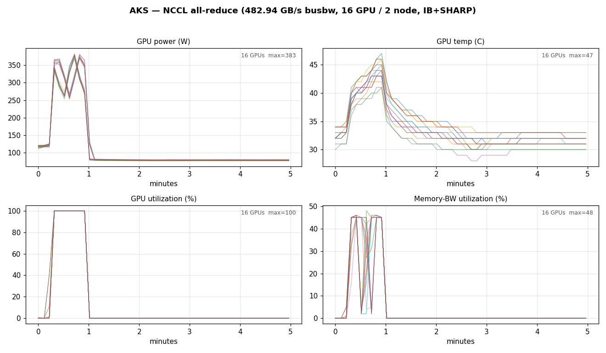
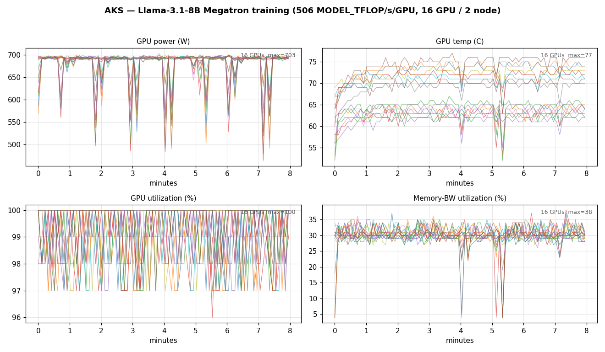
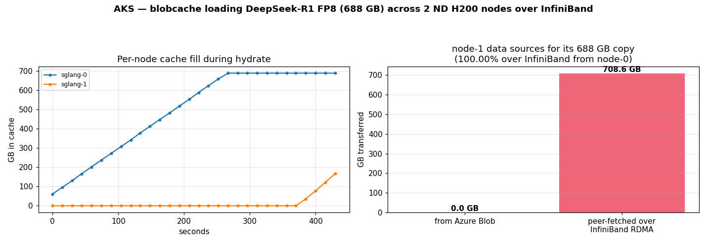
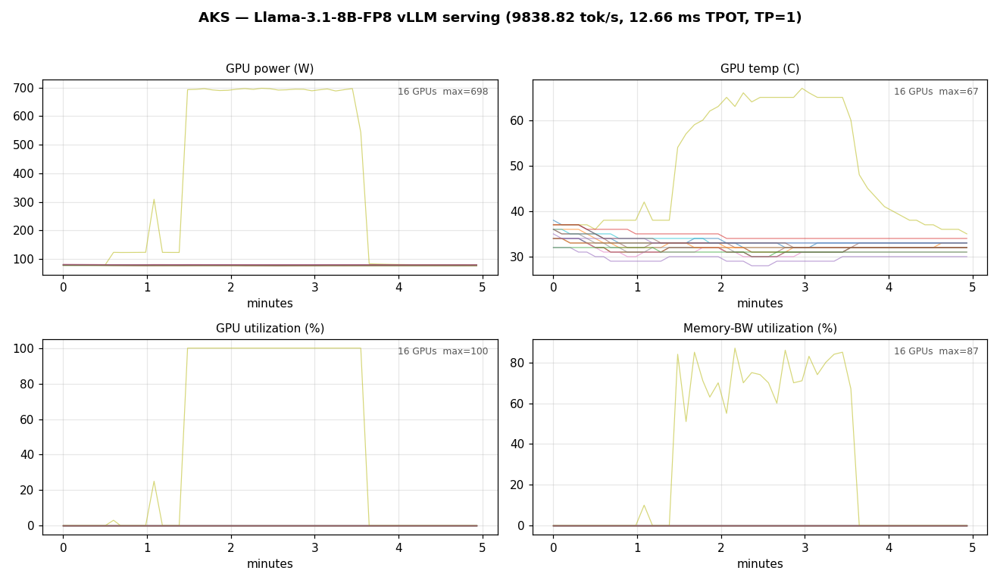
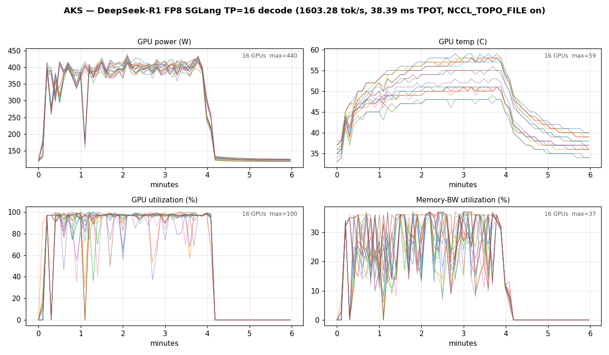

# AKS target — full walkthrough (v0.25.0)

End-to-end `azcluster deploy --target aks`, captured on cluster `cmpaks8`, **2× Standard_ND96isr_H200_v5 / mexicocentral**, on 2026-06-19. Every GPU panel below is rendered from **per-node `nvidia-smi` sampled directly on the GPUs** (via the `nvidia-driver-daemonset` pods) during each job window — the same capture approach as the Slurm walkthrough, for complete per-GPU coverage (power, temperature, GPU utilization, memory-bandwidth utilization for all 16 GPUs). Monitoring is also ON: the same DCGM signals flow to the per-cluster Azure Monitor Workspace via the managed-Prometheus ServiceMonitor and are live in Grafana.

This is the AKS half of a **controlled comparison** with the Slurm target ([`full-walkthrough-slurm-v0.25.0.md`](full-walkthrough-slurm-v0.25.0.md)): identical hardware (2× ND H200 v5), region (mexicocentral), models, and benchmark parameters. The only deliberate variation is the scheduler/runtime stack — Kubernetes + Kueue/MPI-Operator/Training-Operator + NVIDIA operators here, Slurm + Pyxis/Enroot there. `azcluster` provisions infrastructure only; every workload is a runnable manifest under [`examples/aks/`](../examples/aks/) applied with `kubectl`. Version-agnostic companion: [`walkthrough-plan.md`](walkthrough-plan.md).

## Run summary

| # | Run | Result | Notes |
|---|---|---|---|
| 0 | Deploy + operators | OK (30 resources, ~1120 s) | mexicocentral, monitoring ON; cert-manager → NVIDIA Network/GPU operators → DCGM ServiceMonitor → Kueue → MPI-Operator → Azure Container Storage |
| 1 | Native operate client | OK | `exec`/`logs`/`ssh` over the Kubernetes API, no laptop `kubectl` |
| 2 | **NCCL containerized** (MPIJob), `-b 16G -e 16G -N 10` | **482.94 GB/s** avg busbw | 16 ranks / 2 nodes; 8 IB/SHARP devices per node, no TCP fallback |
| 3 | Megatron-Bridge training — Llama-3.1-8B, 16 GPU / 2 node | **506 MODEL_TFLOP/s/GPU** | PyTorchJob, gbs256, tp1 pp1 cp2 mbs1, 50 iters |
| 4 | Storage — blobcache peer reads over InfiniBand | **708.6 GB of the 688 GB DeepSeek load peer-fetched over IB RDMA (100%)** | node-0 from Blob, node-1 entirely from peer; ACStor NVMe cache |
| 5 | Llama-3.1-8B-FP8 vLLM bench | **9,838.82 tok/s, 12.66 ms median TPOT** | TP=1, conc 128, served via blobcache |
| 6 | DeepSeek-R1-0528 FP8 SGLang TP=16 (with `ndv5-topo`) | **1,603.28 tok/s, 38.39 ms median TPOT** | 16 ranks / 2 nodes, conc 64, 640/640 requests, 239 s |

## 0. Deploy

```bash
azcluster deploy --target aks --name cmpaks8 \
  --location mexicocentral --grafana-location eastus \
  --pool name=gpu,sku=Standard_ND96isr_H200_v5,count=2,default
```

The AKS path registers the subscription InfiniBand feature, deploys the parallel `bicep/aks-main.json` template (managed cluster + GPU agent pool with `gpuProfile.driver: None` so the NVIDIA GPU Operator owns the driver), then stages operator installs via AKS `runCommand`: cert-manager, NVIDIA Network Operator (MOFED/SR-IOV — advertises `rdma/ib: 8` per GPU node), NVIDIA GPU Operator, the managed-Prometheus DCGM ServiceMonitor, Kueue, MPI-Operator, and Azure Container Storage (`local-csi`, auto-RAID-0 of the node NVMe). `--grafana-location eastus` because `Microsoft.Dashboard/grafana` is not available in mexicocentral. (Unlike the Slurm path, AKS installs operators from registries/Helm — nothing is keyed to a GitHub release, so the default `v0.25.0` version label is fine even though no `v0.25.0` release exists yet.)

## 1. Native operate client (no laptop kubectl)

`exec`/`logs`/`ssh` talk to the API server directly over client-cert TLS + WebSocket (no `kube-rs`; the workspace is pinned below its MSRV):

```bash
azcluster exec cmpaks8 --host gpu-operator/<pod> -- nvidia-smi -L   # lists 8× H200
azcluster logs cmpaks8 --component gpu-operator/<pod> --tail 8
azcluster ssh  cmpaks8 --host aks-gpu-...-vmss000000               # host-root chroot debug shell
```

## 2. NCCL validation (2-node, containerized)

```bash
NODES=2 NP=16 envsubst '${NODES} ${NP}' < examples/aks/nccl-allreduce-mpijob.yaml | kubectl apply -f -
```

The MPIJob runs `all_reduce_perf_mpi -b 16G -e 16G -f 2 -g 1 -N 10`, 16 ranks across 2 nodes — the *same* benchmark as the Slurm rows. Result: **482.94 GB/s avg busbw**, all 8 `mlx5_0..7` IB devices with SHARP per node (16 NICs across the job), no TCP fallback. The launcher loops on `getent hosts` for every worker before invoking `mpirun` to dodge the headless-service DNS race.



Brief 100%-utilization spike at ~383 W across all 16 GPUs (all-reduce shuffles data over IB rather than doing heavy compute, so power stays well below the training ceiling), then back to idle.

## 3. Training — DGXC Megatron-Bridge, Llama-3.1-8B

```bash
kubectl apply -f examples/aks/training-operator.yaml      # git-free, scheme-gated to pytorchjob
# create the megatron-pretrain.py ConfigMap, then:
CP=2 GBS=256 TRAIN_ITERS=50 WORKER_REPLICAS=1 \
  envsubst '${CP} ${GBS} ${TRAIN_ITERS} ${WORKER_REPLICAS}' \
  < examples/aks/training-megatron-pytorchjob.yaml | kubectl apply -f -
```

> Render note: use the **allowlist** form of `envsubst` (the four training params only). A bare `envsubst` clobbers the manifest's runtime shell vars (`$RANK`, `$WORLD_SIZE`, `$MASTER_ADDR`) to empty and `torchrun` dies with `--node_rank: invalid int value: ''`. Pass the four params via the environment so the allowlist substitution actually fills them.

PyTorchJob, 16 GPUs / 2 nodes, gbs256, `tp1 pp1 cp2 mbs1`, 50 iters. Steady-state **506 MODEL_TFLOP/s/GPU** — within run-to-run variance of the Slurm 515. The launcher init-container loops on master DNS before `torchrun` (the same worker-DNS race as the MPIJob).



~700 W full-tilt (max 703 W) across all 16 GPUs at ~96–100% utilization with brief per-iteration sync dips — the FP/BF16 GEMMs saturate the H200 tensor cores. (The Megatron-Bridge master never exits cleanly after the final iteration; a pod `Error` after the metric is logged is the documented teardown behaviour, not a failure.)

## 4. Storage — blobcache peer reads over InfiniBand

The DeepSeek-R1-0528 FP8 weights (688 GB) are staged to the per-cluster Blob account once (`hf download` → ACStor scratch → `azcp copy`), then served to the SGLang pods through a privileged **blobcache** sidecar that does FUSE reads backed by a UCX/RDMA p2p transport over the same 8 IB HCAs (sharing them with NCCL at the hardware level, without taking the exclusive `rdma/ib` device).

`POST /hydrate` shards the origin fetch, then as SGLang reads the 163 safetensors shards each node **peer-fetches the chunks it lacks from the other node over IB RDMA**, falling back to Blob only when no peer holds the chunk:



On this run the split was near-total: **node-0 pulled the entire 688 GB from Azure Blob, and node-1 fetched its full copy — 708.6 GB — over InfiniBand RDMA from node-0, with only 3.6 MB from Blob (100.00% over IB)** (`blobcache_peer_fetch_bytes_total` = 708.6 GB, `blobcache_blob_fetch_bytes_total` = 3.6 MB on node-1; `blobcache_cache_bytes` ≈ 685 GB each). The left panel shows node-0's cache fill from Blob ramping to 688 GB; the right panel shows node-1 sourced 100% of its copy from the peer over IB. Over half the cluster's total model-load bytes therefore moved over the IB fabric, not from Blob.

> Footgun fixed live: the blobcache sidecar must point at *this* cluster's storage account + kubelet managed-identity client-id (both freshly generated per deploy). A stale account name makes `list_blobs` fail, `/hydrate` hangs, and the SGLang launch script blocks on the hydrate curl before ever calling `launch_server`.

## 5. Inference — vLLM (Llama-3.1-8B-FP8)

```bash
MI_CLIENT_ID=<kubelet client id> STORAGE_ACCOUNT=<sa> MODEL_DIR=/mnt/blobcache/data/models/llama-3.1-8b-fp8 \
  envsubst '${MI_CLIENT_ID} ${STORAGE_ACCOUNT} ${MODEL_DIR}' \
  < examples/aks/inference-vllm.yaml | kubectl apply -f -
```

```
Output token throughput (tok/s):         9838.82
Median TPOT (ms):                        12.66
Median TTFT (ms):                        69.07
```

**9,838.82 tok/s, 12.66 ms median TPOT** (TP=1, conc 128, 1280 requests), served from blobcache. Matches the Slurm 9,880.19 — single-GPU inference is the cleanest stack-vs-stack row and the two are effectively identical.



## 6. Inference — DeepSeek-R1-0528 SGLang TP=16 (multi-node)

```bash
kubectl create configmap ndv5-topo --from-file=ndv5-topo.xml=examples/aks/ndv5-topo.xml \
  --dry-run=client -o yaml | kubectl apply -f -
STORAGE_ACCOUNT=<sa> MI_CLIENT_ID=<kubelet client id> MODEL_PREFIX=dsr1-fp8 \
  envsubst '${STORAGE_ACCOUNT} ${MI_CLIENT_ID} ${MODEL_PREFIX}' \
  < examples/aks/inference-sglang-multinode.yaml | kubectl apply -f -
```

A StatefulSet (stable head DNS `sglang-0.sglang`) runs blobcached + SGLang per pod; rank derives from `${HOSTNAME##*-}`; the server serves-and-stays and is benched via a separate `kubectl exec` once `/health` returns 200 (after the ~9 min CUDA-graph capture + DeepGEMM JIT warmup). Bench: strip the tokenizer `auto_map` into a writable dir, `--dataset-name random` with a synthetic seed, 640 prompts, conc 64.

```
Successful requests:                     640
Benchmark duration (s):                  239.32
Output token throughput (tok/s):         1603.28
Median TPOT (ms):                        38.39
Median TTFT (ms):                        162.13
```

**1,603.28 tok/s aggregate output, 38.39 ms median TPOT, 640/640 requests** — with the `ndv5-topo` ConfigMap mounted and `NCCL_TOPO_FILE` set, AKS matches and exceeds the Slurm baseline (1,528.79).



~400–440 W memory-bound decode across all 16 GPUs at ~95–100% utilization for the ~240 s bench.

### `NCCL_TOPO_FILE` is required (and the busid trap)

Latency-bound TP=16 decode needs the NDv5 topology so NCCL builds the correct GPU↔NIC↔NVLink routing. **Without it, decode runs ~20 % slower: 1,339 tok/s / 44.6 ms vs 1,603 tok/s / 38.39 ms.** This is *not* a Slurm-vs-AKS architectural difference — azcluster sets `NCCL_TOPO_FILE=/opt/microsoft/ndv5-topo.xml` automatically on Slurm because the marketplace HPC image bakes the topology in; the plain Ubuntu AKS image does not, so the example mounts the same canonical file (the `ndv5-topo` ConfigMap, byte-identical to [Azure/azhpc-images/topology](https://github.com/Azure/azhpc-images/tree/master/topology)). If azcluster did not set the Slurm env automatically, Slurm would need the same manual mount.

Two reasons the 16 GiB NCCL bandwidth test (§2, 483 GB/s) does not catch this, and one trap:
- Decode is dominated by many small/medium **latency-bound** collectives per token; the topology drives small-message routing. Large-message busbw and HBM copy bandwidth are identical with or without the file.
- **Do not reformat the topology busids to match `nvidia-smi`.** `nvidia-smi --query-gpu=pci.bus_id` displays the PCI domain as 8 hex digits (`00000001:00:00.0`), but NCCL internally uses the 4-hex form (`0001:00:00`). Pad them to 8 hex and NCCL silently ignores the file (no error) — which reproduces the slow generic-topology result. Use the canonical file unmodified; verify with `NCCL_DEBUG=INFO` → `Loading topology file /etc/topology/ndv5-topo.xml`.

## 7. Controlled comparison (cmpaks8 vs cmpsl8)

| Test | AKS (cmpaks8) | Slurm (cmpsl8) |
|---|---|---|
| NCCL containerized (16 ranks) | **482.94 GB/s** | **483.26 GB/s** |
| Megatron training (16 GPU) | **506 TFLOP/s/GPU** | **515 TFLOP/s/GPU** |
| vLLM Llama-3.1-8B-FP8 | **9,838.82 tok/s** | **9,880.19 tok/s** |
| DeepSeek-R1 SGLang TP=16 | **1,603.28 tok/s** (with `ndv5-topo`) | **1,528.79 tok/s** |

Every workload lands within run-to-run variance across the two stacks — the controlled comparison holds. DeepSeek decode on AKS slightly *exceeds* Slurm once the topology file (which Slurm gets for free from the image) is mounted.

## Observability

The panels above are matplotlib renders of per-node `nvidia-smi` sampled during each job window (16 GPUs across 2 nodes), captured the same way as the Slurm walkthrough so the two are directly comparable. Monitoring is also ON: AKS managed Prometheus (ama-metrics addon) → the per-cluster AMW; the DCGM ServiceMonitor (`azmonitoring.coreos.com/v1`, namespace `gpu-operator`) scrapes `nvidia-dcgm-exporter`, `count(DCGM_FI_DEV_GPU_UTIL)` = 16 across both nodes, and Azure's curated **Kubernetes | NVIDIA GPU DCGM Exporter** dashboard works against the AMW.

## Tear-down

```bash
azcluster delete cmpaks8
azcluster purge-kv --name cmpaks8 --location mexicocentral --yes
```
