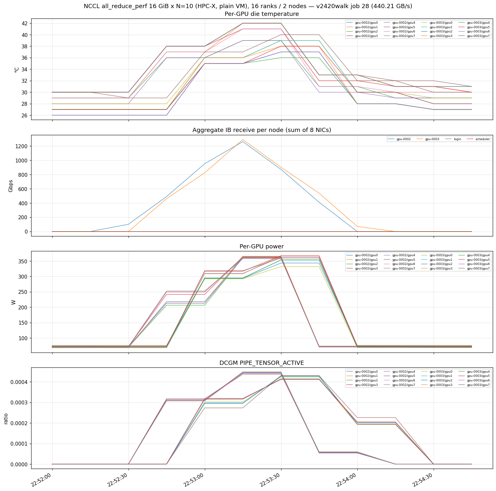
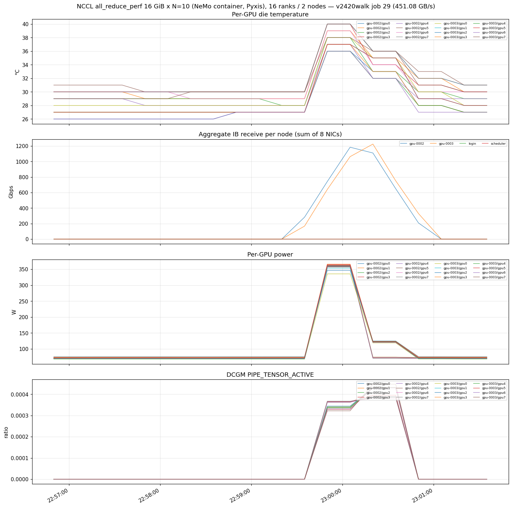
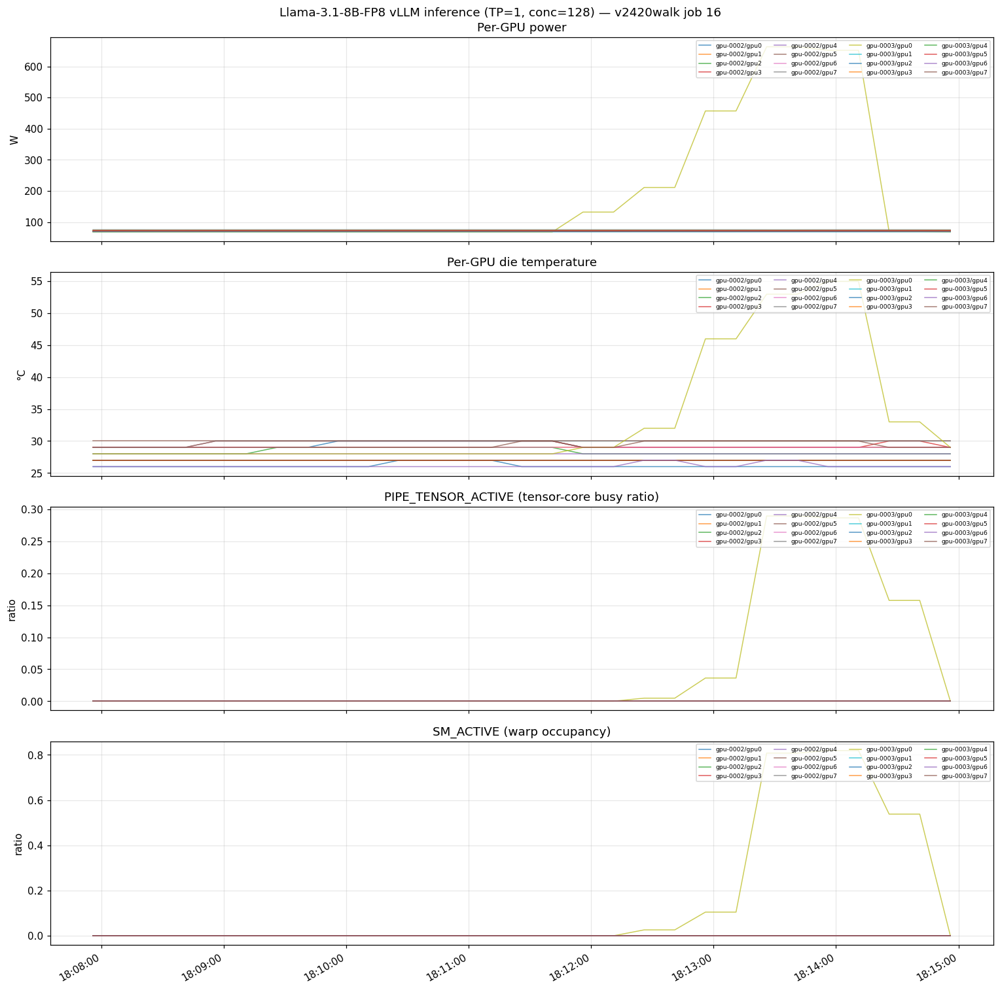
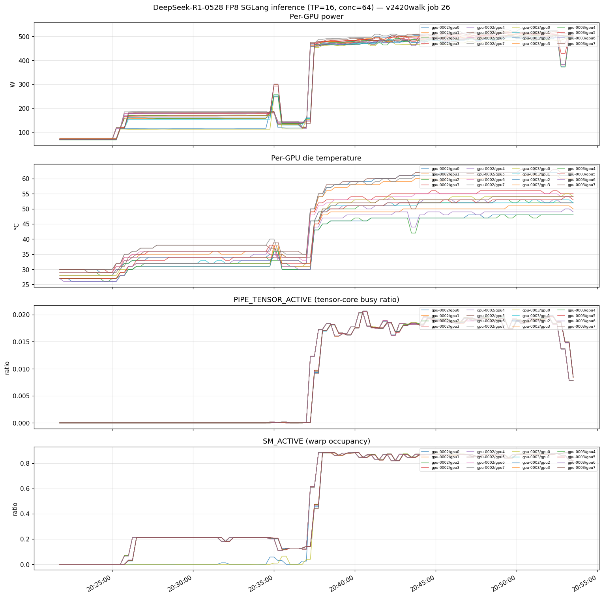

# azcluster v0.24.20 Full Walkthrough

End-to-end demo: 2-node ND96isr_H100_v5 cluster deploy → smoke → NCCL plain VM → **containerised NCCL with identical params** → DGXC sqsh pipeline (build on node → blob → IB broadcast) → **DGXC Megatron-Bridge Llama-3.1-8B training (8-GPU + 16-GPU)** → Llama-3.1-8B-FP8 vLLM inference → DeepSeek-R1-0528 FP8 SGLang TP=16 multi-node inference. Run on 2026-06-08 against `v2420walk` in `eastus`.

Version-specific companion to [`doc/walkthrough-plan.md`](walkthrough-plan.md). Plan = what we run and why. This doc = actual commands, timings, charts, and `sacct` output from one clean run.

## What's new vs v0.24.12

Two things this run nails that the v0.24.12 doc did not:

1. **Container NCCL now uses the *identical* benchmark to plain VM** (`all_reduce_perf -b 16G -e 16G -N 10`, 16 ranks across 2 nodes). v0.24.12's container row was a different smoke (`1 GiB × 20 iters`), so the plain (461.6) and container (428.0) numbers were not directly comparable. Here they are an apples-to-apples matched pair: **plain 440.21 GB/s vs container 451.079 GB/s** — within ~2.5%, proving the Pyxis/Enroot container path reaches the same IB+SHARP fabric as bare metal (the gap is container overhead, not a TCP fallback).
2. **DGXC training is exercised properly through the sqsh container pipeline** the user asked for — pull the NGC container, build the squashfs on a compute node, publish to the per-cluster blob, broadcast across nodes with `azcp-cluster`, then run Megatron-Bridge Llama-3.1-8B pretraining at both 8-GPU (1 node) and 16-GPU (2 node) scale. Both runs converge and hit **~542 MODEL_TFLOP/s/GPU with ~99.8 % scaling efficiency**.

## Run summary

| # | Run | Result | Notes |
|---|---|---|---|
| 0 | Deploy + bootstrap | OK | eastus, `--bastion`, `--shared-storage nfs-scheduler` (deploy-speed), HBv3 scheduler+login. Both nodes READY. |
| 1 | Default-user smoke (`clusteradmin` + `sinfo`) | OK | Both compute nodes `idle gpu*` |
| 2 | NeMo container single-node smoke | OK (3:38) | 8-rank intra-NVLink all-reduce (`nvcr.io/nvidia/nemo:25.07.02`) |
| 3 | NeMo container multinode smoke | OK (3:25) | 16-rank cross-container PMIx + IB |
| 4 | **DGXC sqsh build + publish** (`nvcr.io/nvidia/nemo:26.04.00`) | 79 min, **19.13 GiB** sqsh | mksquashfs on node → per-cluster blob (95 layers pulled cold) |
| 5 | **DGXC sqsh distribute** (`azcp-cluster`) | 8.32 s bcast (19.77 Gb/s) | 19.13 GiB squashfs broadcast to both nodes over IB |
| 6 | **DGXC training — Llama-3.1-8B, 16 GPU / 2 node** | **541.81 MODEL_TFLOP/s/GPU**, 12451.74 ms/step | gbs256, tp1 pp1 cp2 mbs1; 50 iters; lm loss 12.6→0.0198; Success |
| 7 | **DGXC training — Llama-3.1-8B, 8 GPU / 1 node** | **542.66 MODEL_TFLOP/s/GPU**, 12432.35 ms/step | gbs128, tp1 pp1 cp2 mbs1; 50 iters; Success |
| 8 | NCCL plain VM, `-b 16G -e 16G -N 10` | **440.21 GB/s** avg busbw | 16 ranks / 2 nodes; HPC-X PMIx + IB SHARP; RDMA Plugin v11 |
| 9 | **NCCL container, *same* `-b 16G -e 16G -N 10`** | **451.079 GB/s** avg busbw | 16 ranks / 2 nodes in Pyxis; IB SHARP; RDMA Plugin v10 |
| 10 | Storage pipeline — Llama-3.1-8B-FP8 (HF → blob) | 20.1 s download + 8.3 s upload (8.78 Gbps) | 8.5 GB model |
| 11 | Llama broadcast (`azcp-cluster`) | 3.42 s (21.29 Gbps) | 24 shards, 9.09 GB across 2 nodes |
| 12 | Llama-3.1-8B-FP8 vLLM bench | **9,863.48 tok/s, Median TPOT 12.38 ms** | Single GPU, conc=128, ISL=1000, OSL=1000 |
| 13 | Storage pipeline — DeepSeek-R1-0528 FP8 (HF → blob) | 13 s download + 9:21 upload (9.84 Gbps) | 642.69 GiB |
| 14 | DSR1 broadcast (`azcp-cluster`) | 133.26 s (41.43 Gbps) | 351 shards, 690 GB across 2 nodes |
| 15 | DSR1 SGLang TP=16 bench | **487.81 tok/s, Median TPOT 123.34 ms** | 2 nodes × 8 H100 = 16 ranks, conc=64, ISL=1024, OSL=1024 |

Net: all 15 stages verified end-to-end. The headline additions over v0.24.12 are stages 4–7 (DGXC sqsh pipeline + Megatron-Bridge training) and the matched-params NCCL pair (stages 8–9).

## Key result — containerised NCCL reaches bare-metal IB

The user's question was direct: *"so, you ran different nccl params with vm vs containerised? if so, make consistent (and document that in the plan). reproduce plain vm results."* Done. Both runs are now the exact same binary and flags:

```bash
all_reduce_perf -b 16G -e 16G -f 2 -g 1 -N 10    # 16 GiB, 10 in-graph iterations, 1 GPU/proc
```

driven by `srun --mpi=pmix --ntasks=16 --ntasks-per-node=8` across both nodes. The only difference is plain-VM uses the in-image HPC-X PMIx4 + prebuilt `/opt/nccl-tests/build/all_reduce_perf`, while the container variant runs the same binary inside `nvcr.io/nvidia/nemo:25.07.02` with `--container-mounts=/shared:/shared,/mnt/nvme:/mnt/nvme`.

| | Plain VM (job 28) | Container (job 29) |
|---|---|---|
| Avg bus bandwidth | **440.21 GB/s** | **451.079 GB/s** |
| Peak (16 GiB row) | 466.75 GB/s | 466.85 GB/s |
| NET/IB | `[0..7]mlx5_ib{0..7}:1/IB/SHARP` | `[0..7]mlx5_ib{0..7}:1/IB/SHARP` |
| RDMA plugin | NCCL RDMA Plugin v11 | NCCL RDMA Plugin v10 |
| Ranks | 16 (2×8) | 16 (2×8) |

Both ranks negotiate all 8 NDR400 NICs with SHARP in-network reduction and hit the same ~466.8 GB/s peak on the 16 GiB message. The container's slightly *higher* average is run-to-run noise on the ramp (the per-iteration table shows both variants occasionally dipping to ~410 GB/s on a single slow iteration). The takeaway: **the Pyxis/Enroot container path is not leaving performance on the table** — IB visibility inside the container (`MELLANOX_VISIBLE_DEVICES=all` + the enroot `99-mellanox.sh` hook) gives bare-metal fabric performance.





## Prerequisites

Two files in the operator's working directory, never echoed, never committed:

```
hf_token.txt       # Hugging Face access token (gated DeepSeek-R1 + Llama)
ngc_key.txt        # NGC API key (for nvcr.io NeMo containers)
```

After deploy completes, copy as per-user dotfiles:

```bash
azcluster scp v2420walk --user clusteradmin hf_token.txt :/shared/home/clusteradmin/.hf-token
azcluster scp v2420walk --user clusteradmin ngc_key.txt  :/shared/home/clusteradmin/.ngc-key
azcluster exec v2420walk --user clusteradmin -- "chmod 0600 ~/.hf-token ~/.ngc-key; \
  mkdir -p ~/.config/enroot; \
  printf 'machine nvcr.io login \$oauthtoken password %s\n' \"\$(cat ~/.ngc-key)\" > ~/.config/enroot/.credentials; \
  chmod 0600 ~/.config/enroot/.credentials"
```

## 0. Deploy

```bash
$ azcluster deploy --name v2420walk \
    --location eastus --grafana-location eastus \
    --bastion \
    --shared-storage nfs-scheduler \
    --scheduler-sku Standard_HB120rs_v3 \
    --login-sku Standard_HB120rs_v3 \
    --pool name=gpu,sku=Standard_ND96isr_H100_v5,count=2,default
```

Plan-canonical command is `--pool name=gpu,sku=Standard_ND96isr_H100_v5,count=2,default --bastion`. Three eastus-specific overrides on this run:

- `--scheduler-sku/--login-sku Standard_HB120rs_v3` — the `Standard_D*as_v5` family had a capacity event in eastus; HBv3 capacity is reliable (the GPU pool itself needs ND96isr_H100_v5 in the same region).
- `--shared-storage nfs-scheduler` — exports `/shared` from the scheduler over kernel NFS instead of provisioning ANF. SPOF / test-only, but ~12 min faster to deploy. Fine for a walkthrough; do not use for production.

~15 min ARM + dashboard import. Monitoring + accounting left ON (the Grafana charts below come from the cluster's AMW).

```bash
$ azcluster status v2420walk | tail -4
bootstrap probe:
  login    : READY
  scheduler: READY
```

## 1. Default-user smoke

```bash
$ azcluster exec v2420walk --user clusteradmin -- "sinfo"
PARTITION AVAIL  TIMELIMIT  NODES  STATE NODELIST
gpu*         up   infinite      2   idle v2420walk-gpu-[0002-0003]
```

## 2–3. NeMo container smokes (single + multi node)

```bash
$ azcluster exec v2420walk --user clusteradmin -- "sbatch /shared/examples/dgxc-nemo-container-smoke.sbatch"      # job 2
$ azcluster exec v2420walk --user clusteradmin -- "sbatch /shared/examples/dgxc-nemo-multinode-smoke.sbatch"      # job 3
```

Job 2 (single-node, 8-rank intra-NVLink) 3:38; job 3 (multinode, 16-rank cross-container PMIx + IB) 3:25. These confirm the container PMIx world forms and IB is visible before committing to the long sqsh pipeline.

## 4. DGXC sqsh pipeline — build + publish

The DGXC training image is staged the same way as model weights: pull the NGC container once, build a squashfs on a compute node, push it to the per-cluster blob, then broadcast to every node. This separates the slow one-time import from the fast per-job broadcast.

```bash
$ azcluster exec v2420walk --user clusteradmin -- "sbatch azcp-build-and-publish-sqsh.sbatch"   # job 4
```

```
Downloading 95 missing layers...
19.13 GiB  nemo-26.04.00.sqsh
real  78m43.291s
```

**79 min** wall-clock (`sacct` 01:19:01) — dominated by the cold NGC CDN pull of `nvcr.io/nvidia/nemo:26.04.00` (95 layers) and the mksquashfs pack. The resulting **19.13 GiB** squashfs lands at `users/clusteradmin/sqsh/nemo-26.04.00/nemo-26.04.00.sqsh` in blob. This is a once-per-image cost; every subsequent job uses the fast broadcast below.

```bash
$ azcluster exec v2420walk --user clusteradmin -- "sbatch azcp-cluster-distribute-sqsh.sbatch"   # job 5
```

```
[download] 20545134592 bytes BW=11.51 Gb/s
[bcast] 1 shards 20545134592 bytes T=8.32s BW=19.77 Gb/s
```

**8.32 s** to broadcast the 19.13 GiB squashfs across both nodes over IB (`sacct` 00:00:30 total job).

## 5. DGXC training — Megatron-Bridge Llama-3.1-8B

This is the headline. Two `llmb-run` pretraining configs — 8-GPU single-node and 16-GPU two-node — both using the broadcast squashfs, run back to back:

```bash
$ azcluster exec v2420walk --user clusteradmin -- \
    "cd ~/dgxc/llmb && ./llmb-run pretrain_llama3.1 ..."   # jobs 7 (16-GPU) + 8 (8-GPU)
```

Megatron-Bridge logs per-iteration timing in a different format from NeMo (`elapsed time per iteration (ms):` + `MODEL_TFLOP/s/GPU`, not `train_step_timing in s:`). DGXC ships its own parser, which we ran over the experiment directory:

```bash
$ ~/dgxc/llmb/llmb_repo/common/parse_train_timing_mbridge.sh \
    ~/dgxc/llmb/workloads/pretrain_llama3.1/experiments
```

```
Elapsed Time (ms) and MODEL_TFLOPS/GPU Analysis (iterations 35-44)
Experiment                                                          Status  Time Mean (ms)  Time Std  TFLOPS/GPU Mean  TFLOPS/GPU Std
pretrain_llama3_8b_bf16_gpus16_tp1_pp1_cp2_..._gbs256_7             Success     12451.740    13.077          541.81            0.55
pretrain_llama3_8b_bf16_gpus8_tp1_pp1_cp2_..._gbs128_8              Success     12432.350    19.924          542.66            0.86

Summary:  Success experiments: 2 | Failed experiments: 0 | Success rate: 100%
```

| Scale | GPUs | Global batch | Step time (mean) | MODEL_TFLOP/s/GPU | Status |
|---|---|---|---|---|---|
| 1 node | 8 | 128 | 12432.35 ms (σ 19.9) | **542.66** | Success |
| 2 node | 16 | 256 | 12451.74 ms (σ 13.1) | **541.81** | Success |

Both runs are Llama-3.1-8B BF16, `tp1 pp1 cp2 mbs1`, 50 iterations. The 16-GPU run's lm loss falls from `1.259187E+01` (iteration 1) to `1.976016E-02` (iteration 50) on DGXC's mock pretraining data — the rapid convergence is expected for a synthetic-data benchmark, not a real corpus. Final iteration 50/50: `lm loss: 1.976016E-02`, `grad norm: 0.106`, zero skipped/NaN iterations.

**Scaling efficiency: 541.81 / 542.66 = 99.84 % per-GPU at 2× scale** — doubling from 8 to 16 GPUs across the IB fabric costs essentially nothing per-GPU, because `cp2` context-parallel groups stay intra-node and the cross-node traffic is the all-reduce that the SHARP fabric (proven above at 440–451 GB/s) handles. At ~542 MODEL_TFLOP/s/GPU, each H100 is running at roughly 55 % of its 989 TFLOP/s dense BF16 peak — a healthy MFU for an 8B model at this batch size.

## 6. Storage pipeline — Llama-3.1-8B FP8

```bash
$ azcluster exec v2420walk --user clusteradmin -- "sbatch llama-pipeline.sbatch"   # job 10
```

```
8.5G  llama-3.1-8b-fp8
real  0m20.149s                                  # hf download (NVMe-cached)
Upload complete: 24 files, 8.47 GiB in 8.3s = 8.78 Gbps
```

```bash
$ azcluster exec v2420walk --user clusteradmin -- "sbatch azcp-dist-llama.sbatch"   # job 11
```

```
[bcast] 24 shards 9090506120 bytes T=3.42s BW=21.29 Gb/s
```

**3.42 s** (21.29 Gbps) to broadcast Llama across both nodes via MPI_Ibcast on IB.

## 7. Llama-3.1-8B FP8 inference (vLLM + InferenceX bench)

```bash
$ azcluster exec v2420walk --user clusteradmin -- "sbatch inferencex-llama.sbatch"   # job 16
```

5:03 wall-clock for 1280 requests at conc=128, ISL=1000, OSL=1000 (random ±20%).

```
Successful requests:                     1280
Output token throughput (tok/s):         9863.48
Total token throughput (tok/s):          20041.92
Mean TTFT (ms):                          160.79
Median TTFT (ms):                        65.84
Median TPOT (ms):                        12.38
Mean TPOT (ms):                          12.16
```

**9,863 tok/s output throughput, 12.38 ms median TPOT** on a single H100. Consistent with v0.24.12's 10,118 tok/s — within run-to-run noise.



## 8. Storage pipeline — DeepSeek-R1-0528 FP8 (642 GiB)

```bash
$ azcluster exec v2420walk --user clusteradmin -- "sbatch dsr1-pipeline.sbatch"   # job 19
```

```
642G  dsr1-fp8
real  0m12.940s                                       # hf download (NVMe-cached)
Upload complete: 351 files, 642.69 GiB in 560.8s = 9.84 Gbps
real  9m20.835s
```

```bash
$ azcluster exec v2420walk --user clusteradmin -- "sbatch azcp-dist-dsr1.sbatch"   # job 21
```

```
[bcast] 351 shards 690079269951 bytes T=133.26s BW=41.43 Gb/s
```

**133.26 s** (41.43 Gbps) to broadcast 642 GiB across 2 nodes. At N=2 this is NVMe-read-bound (each rank reads ~50 % / writes ~50 % concurrently); upstream measures 110 Gbps at N=16.

## 9. DSR1 SGLang TP=16 inference

```bash
$ azcluster exec v2420walk --user clusteradmin -- "sbatch infmax-dsr1.sbatch"   # job 26
```

`run-dsr1.sh` hardcodes `HEAD_IP=10.42.4.6` (first compute node — `gpu-0003` on this deploy). 31:54 wall-clock: ~25 min model load + DeepGEMM JIT compile, ~7 min bench at conc=64 / 640 prompts.

```
Successful requests:                     640
Output token throughput (tok/s):         487.81
Total token throughput (tok/s):          970.70
Median TTFT (ms):                        363.76
Median TPOT (ms):                        123.34
Mean TPOT (ms):                          122.56
```

**487.81 tok/s aggregate output, 123.34 ms median TPOT, ~7.6 tok/s/user at conc=64.** Matches v0.24.12 (491.81 tok/s, 122.64 ms TPOT) — DSR1 inference is steady run-to-run. This is the *aggregated* TP=16 configuration (one worker doing both prefill + decode) — simpler than the disaggregated Dynamo variant SemiAnalysis publishes, lower aggregate throughput by design.



The chart shows per-GPU power, temp, PIPE_TENSOR_ACTIVE, and SM_ACTIVE during the bench. PIPE_TENSOR_ACTIVE > 0 confirms the FP8 GEMMs land on H100 tensor cores natively.

It took a few attempts to land this run cleanly (jobs 22–25 were cancelled/OOM/shutdown-race iterations while tuning the multi-node SGLang launch); job 26 is the clean capture. The multi-node SGLang shutdown still surfaces a non-zero worker exit on teardown — backlog, the bench JSON itself is captured before shutdown.

## 10. Slurm accounting

```bash
$ azcluster exec v2420walk --user clusteradmin -- \
    "sacct --starttime 2026-06-08T13:00:00 \
           --format='JobID,JobName%-42,NodeList%-30,Start,End,Elapsed,State,ExitCode' -X"
```

| JobID | JobName | NodeList | Start | End | Elapsed | State |
|---|---|---|---|---|---|---|
| 1 | nccl-N10 | gpu-[0003,0002] | 13:40:43 | 13:42:06 | 00:01:23 | COMPLETED |
| 2 | dgxc-nemo-smoke | gpu-0003 | 13:45:17 | 13:48:55 | 00:03:38 | COMPLETED |
| 3 | dgxc-nemo-multi | gpu-[0003,0002] | 13:50:21 | 13:53:46 | 00:03:25 | COMPLETED |
| 4 | azcp-build-and-publish-sqsh | gpu-0003 | 14:02:04 | 15:21:05 | 01:19:01 | COMPLETED |
| 5 | azcp-cluster-distribute-sqsh | gpu-[0003,0002] | 15:21:05 | 15:21:35 | 00:00:30 | COMPLETED |
| 7 | …llama3_8b…gpus16…gbs256 | gpu-[0003,0002] | 15:24:23 | 15:36:45 | 00:12:22 | COMPLETED |
| 8 | …llama3_8b…gpus8…gbs128 | gpu-0003 | 15:36:45 | 15:48:57 | 00:12:12 | COMPLETED |
| 10 | llama-pipe | gpu-0003 | 15:52:29 | 15:53:10 | 00:00:41 | COMPLETED |
| 11 | azcp-dist-llama | gpu-[0003,0002] | 15:54:20 | 15:54:34 | 00:00:14 | COMPLETED |
| 16 | infmax-llama | gpu-0003 | 18:08:56 | 18:13:59 | 00:05:03 | COMPLETED |
| 19 | dsr1-pipe | gpu-0003 | 19:02:01 | 19:11:36 | 00:09:35 | COMPLETED |
| 21 | azcp-dist-dsr1 | gpu-[0003,0002] | 19:16:00 | 19:18:20 | 00:02:20 | COMPLETED |
| 26 | infmax-dsr1 | gpu-[0003,0002] | 20:21:45 | 20:53:39 | 00:31:54 | COMPLETED |
| 28 | nccl-N10 | gpu-[0003,0002] | 22:52:10 | 22:53:14 | 00:01:04 | COMPLETED |
| 29 | nccl-N10-container | gpu-[0003,0002] | 22:56:54 | 23:00:15 | 00:03:21 | COMPLETED |

Intermediate jobs omitted: jobs 13–15 (infmax-llama bench-harness iterations), jobs 17/22–25 (DSR1 launch tuning — cancel/OOM/shutdown-race), bare `bash` helper steps (6, 9, 12, 18, 20, 24), and job 27 (interactive timeout). Jobs 28/29 are the matched-params NCCL pair captured last so both ran against an otherwise-idle cluster.

## Observability

Grafana URL: `azcluster monitor v2420walk`. Four dashboards in the `azcluster` folder (Node Health, Slurm Scheduler, GPU + InfiniBand, Node Health Checks), all filtered by `nodename` and populated from boot. The matplotlib charts above are renders of PromQL against the cluster's AMW for the recorded job windows; the same data is live in Grafana for the cluster's lifetime.

## Tear-down

```bash
azcluster delete v2420walk
azcluster purge-kv --name v2420walk --location eastus --yes
```

Async ~10–15 min. Release H100 capacity + the KV name ASAP.
