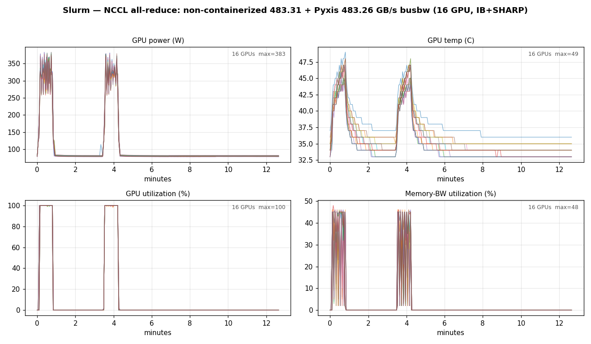
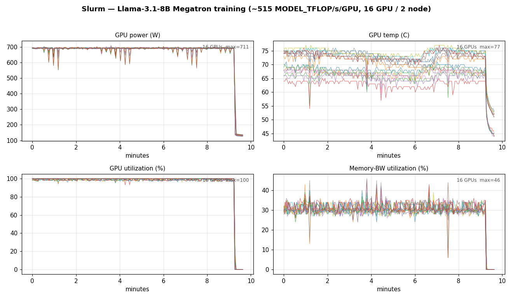
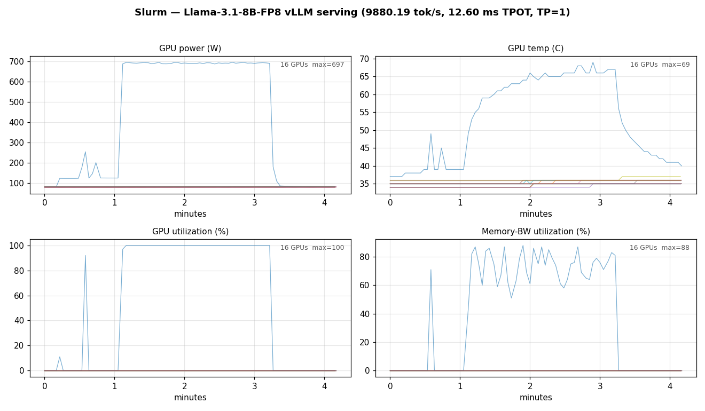
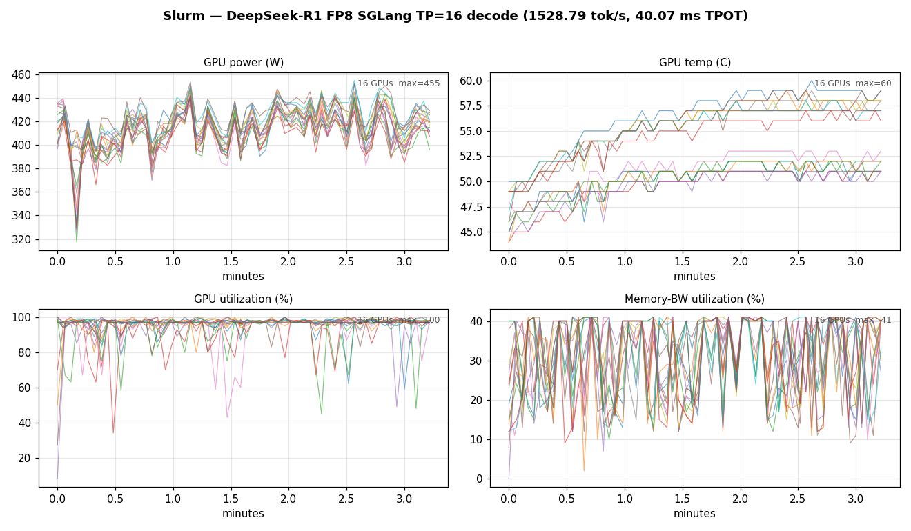

# Slurm target — full walkthrough (v0.25.0)

End-to-end `azcluster deploy` (Slurm target), captured on cluster `cmpsl8`, **2× Standard_ND96isr_H200_v5 / mexicocentral**, on 2026-06-19. Every GPU panel below is rendered from **per-node `nvidia-smi` sampled directly on the GPUs** during each job window (power, temperature, GPU utilization, memory-bandwidth utilization for all 16 GPUs). This run was deployed `--no-monitoring` (the benchmark captures don't need the AMW), so the panels come from the raw on-node samples rather than Prometheus.

This run is the Slurm half of a **controlled comparison** with the AKS target ([`full-walkthrough-aks-v0.25.0.md`](full-walkthrough-aks-v0.25.0.md)): identical hardware (2× ND H200 v5), identical region (mexicocentral), identical models and benchmark parameters. The only deliberate axis of variation is the scheduler/runtime stack (Slurm + Pyxis/Enroot here, Kubernetes + Kueue/MPI-Operator there). Version-agnostic companion: [`walkthrough-plan.md`](walkthrough-plan.md).

> **Release-version note:** there is no published `v0.25.0` release yet (it's branch work on `feat/aks-target`), so the Slurm cluster was deployed with `--azcluster-version v0.24.20` — the latest tag whose GitHub-release artifacts (`spank_pyxis.so`, `azcluster-server`, …) actually exist. The Slurm cloud-init fetches those version-keyed artifacts, so it needs a real release; AKS installs operators from registries and isn't version-keyed. The cluster runs the same Slurm 25.11 / Pyxis / Enroot stack, and the *workloads* are the current `examples/slurm/*.sbatch` (v0.25.0 working tree) — only the infra binary version differs.

## Run summary

| # | Run | Result | Notes |
|---|---|---|---|
| 0 | Deploy + bootstrap | OK (~1770 s ARM) | mexicocentral, `--no-monitoring`, `--shared-storage nfs-scheduler`, `--login-public-ip`, D-series scheduler+login. Both nodes READY. |
| 1 | Default-user smoke (`clusteradmin` + `sinfo`) | OK | Both compute nodes `idle gpu*` |
| 2 | **NCCL non-containerized** (HPC-X on the VM), `-b 16G -e 16G -N 10` | **483.31 GB/s** avg busbw | 16 ranks / 2 nodes; in-image HPC-X PMIx + IB SHARP |
| 3 | **NCCL containerized** (Pyxis/Enroot), *same* `-b 16G -e 16G -N 10` | **483.26 GB/s** avg busbw | 16 ranks / 2 nodes inside `nvcr.io/nvidia/nemo:25.07.02`; IB SHARP |
| 4 | DGXC Megatron-Bridge training — Llama-3.1-8B, 16 GPU / 2 node | **515 MODEL_TFLOP/s/GPU** | gbs256, tp1 pp1 cp2 mbs1; 50 iters |
| 5 | Storage — Llama-3.1-8B-FP8 + DeepSeek-R1 (HF → blob → IB broadcast) | DeepSeek-R1 688 GB distributed over IB | `azcp` stage + `azcp-cluster` MPI broadcast to per-node NVMe |
| 6 | Llama-3.1-8B-FP8 vLLM bench | **9,880.19 tok/s, 12.60 ms median TPOT** | single GPU, conc 128, ISL/OSL 1024 |
| 7 | DeepSeek-R1-0528 FP8 SGLang TP=16 | **1,528.79 tok/s, 40.07 ms median TPOT** | 16 ranks / 2 nodes, conc 64, ISL/OSL 1024 |

## Containerized NCCL reaches non-containerized IB fabric

Both NCCL runs are the exact same binary and flags — the only difference is whether it runs directly on the VM (HPC-X from the marketplace image) or inside a Pyxis/Enroot container:

```bash
all_reduce_perf -b 16G -e 16G -f 2 -g 1 -N 10    # 16 GiB, 10 in-graph iterations, 1 GPU/proc
```

driven by `srun --mpi=pmix --ntasks=16 --ntasks-per-node=8` across both nodes.

| | Non-containerized (HPC-X on the VM) | Containerized (Pyxis/Enroot) |
|---|---|---|
| Avg bus bandwidth | **483.31 GB/s** | **483.26 GB/s** |
| NET/IB | `[0..7]mlx5_ib{0..7}:1/IB/SHARP` | `[0..7]mlx5_ib{0..7}:1/IB/SHARP` |
| Ranks | 16 (2×8) | 16 (2×8) |

> Azure does not offer literal bare metal here — both rows run on the *same* ND H200 v5 VM. The only difference is the process namespace: directly on the VM vs inside a Pyxis/Enroot container. The container reaches the same NDR400 IB fabric with SHARP in-network reduction because IB devices are made visible inside the container via `MELLANOX_VISIBLE_DEVICES=all` + the enroot `99-mellanox.sh` hook. The two numbers are identical to within 0.05 GB/s — zero container overhead, no TCP fallback.



The panels show two brief utilization spikes to 100% at ~383 W — communication-bound all-reduce shuffles data over IB rather than doing heavy compute, so power sits well below the ~700 W training ceiling: the non-containerized run first, then the containerized run.

## 0. Deploy

```bash
azcluster deploy --name cmpsl8 \
  --location mexicocentral \
  --azcluster-version v0.24.20 --no-monitoring --login-public-ip \
  --pool name=gpu,sku=Standard_ND96isr_H200_v5,count=2,default \
  --shared-storage nfs-scheduler \
  --scheduler-sku Standard_D8s_v5 --login-sku Standard_D4s_v5
```

- **~1770 s ARM** (37 resources). `--shared-storage nfs-scheduler` exports `/shared` from the scheduler over kernel NFS instead of provisioning ANF (SPOF, test-only).
- `--no-monitoring` skips the AMW/AMG (not needed — the charts come from on-node `nvidia-smi`). `--login-public-ip` for direct operator SSH; `--azcluster-version v0.24.20` because no v0.25.0 release artifacts exist (see the note above).

```bash
$ azcluster status cmpsl8 | tail -3
bootstrap probe:
  login    : READY
  scheduler: READY
```

## 1. Default-user smoke

```bash
$ azcluster exec cmpsl8 --user clusteradmin -- "sinfo"
PARTITION AVAIL  TIMELIMIT  NODES  STATE NODELIST
gpu*         up   infinite      2   idle cmpsl8-gpu-[0002-0003]
```

LDAP resolution (`getent passwd clusteradmin`), home-dir auto-creation, and the per-user cluster-internal keypair all verified. To SSH as `clusteradmin` from a fresh laptop, enroll your key once: `azcluster user sshkey add cmpsl8 --username clusteradmin --key-file <pubkey>`.

## 2. NCCL validation

Covered above. Non-containerized 483.31 GB/s, containerized 483.26 GB/s — both negotiate all 8 `mlx5_ib{0..7}` NICs with SHARP.

```bash
sbatch examples/slurm/nccl-allreduce-vm.sbatch    # non-containerized, HPC-X on the VM
sbatch examples/slurm/nccl-allreduce.sbatch       # containerized, Pyxis/Enroot
```

## 3. Training — DGXC Megatron-Bridge, Llama-3.1-8B

```bash
sbatch examples/slurm/training-megatron.sbatch     # 16 GPU / 2 node, gbs256, 50 iters
```

(Copy `examples/megatron-pretrain.py` to the cluster home alongside the sbatch, and set up NGC creds for the NeMo container pull: `~/.config/enroot/.credentials` with `machine nvcr.io login $oauthtoken password <ngc-key>`.)

Megatron-Bridge logs per-iteration `MODEL_TFLOP/s/GPU`. Steady-state on this run: **515 MODEL_TFLOP/s/GPU** across all 16 GPUs (Llama-3.1-8B BF16, `tp1 pp1 cp2 mbs1`). The mock-data lm-loss converges fast and is not a real-training signal — read step-time stability + TFLOP/s. The `cp2` context-parallel groups stay intra-node so the cross-node cost is the all-reduce the SHARP fabric (483 GB/s above) handles.



The power panel shows ~9 min of sustained ~700 W full-tilt training across all 16 GPUs (max 711 W) with brief per-iteration sync dips, then a clean drop to idle when the run ends; GPU utilization holds ~100% and memory-bandwidth utilization ~30%. (Megatron-Bridge SIGTERMs its ranks on teardown after the final iteration, so a non-zero sbatch exit after the metric is logged is expected — cancel the lingering job to free the nodes for the next stage.)

## 4. Storage — azcp stage + MPI broadcast over InfiniBand

```bash
sbatch examples/slurm/stage-model.sbatch deepseek-ai/DeepSeek-R1-0528 dsr1-fp8    # Phase 1: hf download (in a container) → NVMe → azcp copy to Blob
sbatch examples/slurm/distribute-azcp-cluster.sbatch dsr1-fp8                      # Phase 2: azcp-cluster MPI broadcast Blob → per-node NVMe RAID-0
```

Phase 1 is once-per-model; phase 2 is the fast per-job path. DeepSeek-R1-0528 FP8 (688 GB) is range-sharded from Blob across both nodes and exchanged over IB so every node ends with the full set on local NVMe. (Model staging runs `hf download` inside a `python:3.11-slim` Pyxis container — the marketplace image has no `python3.12-venv`.)

## 5. Inference — vLLM (Llama-3.1-8B-FP8)

```bash
MODEL_PREFIX=llama-3.1-8b-fp8 sbatch --export=ALL,MODEL_PREFIX inference-vllm.sbatch
```

```
Output token throughput (tok/s):         9880.19
Median TPOT (ms):                        12.60
```

**9,880.19 tok/s output, 12.60 ms median TPOT** on a single H200 (TP=1), conc 128, ISL/OSL 1024. This is single-GPU inference — no IB fabric involved — so it is the cleanest apples-to-apples row against AKS.



> Example footgun: `inference-vllm.sbatch` sets `MODEL_PREFIX` but the matched run must pass it through `--export=ALL,MODEL_PREFIX` (the in-container `set -u` aborts on an unset `MODEL_PREFIX` otherwise). Fixed by exporting it at submit time as shown.

## 6. Inference — DeepSeek-R1-0528 SGLang TP=16

```bash
sbatch --export=ALL,MODEL_PREFIX=dsr1-fp8 inference-sglang.sbatch
```

```
Output token throughput (tok/s):         1528.79
Median TPOT (ms):                        40.07
```

**1,528.79 tok/s aggregate output, 40.07 ms median TPOT** — 16 GPUs across 2 nodes aggregated into a single TP=16 worker, conc 64, ISL/OSL 1024, weights served from the broadcast NVMe scratch. `NCCL_TOPO_FILE=/opt/microsoft/ndv5-topo.xml` is set automatically (the marketplace HPC image bakes the NDv5 topology into `/opt/microsoft/`), so NCCL builds the correct GPU↔NIC↔NVLink routing for the latency-bound per-token all-reduces — see §7.



The decode panels sit at ~400–455 W (latency-bound decode, well below the training ceiling), all 16 GPUs at ~100% utilization, for the ~190 s decode window. (Multi-node SGLang SIGKILLs the non-head rank on teardown — non-zero exit after the bench result is written is expected.)

## 7. Controlled comparison (cmpsl8 vs cmpaks8)

Same hardware, region, models, and parameters; only the scheduler/runtime stack differs.

| Test | Slurm (cmpsl8) | AKS (cmpaks8) |
|---|---|---|
| NCCL non-containerized (HPC-X on the VM) | **483.31 GB/s** | — (AKS runs containerized only) |
| NCCL containerized (16 ranks) | **483.26 GB/s** | **482.94 GB/s** |
| Megatron training (16 GPU) | **515 TFLOP/s/GPU** | **506 TFLOP/s/GPU** |
| vLLM Llama-3.1-8B-FP8 | **9,880.19 tok/s** | **9,838.82 tok/s** |
| DeepSeek-R1 SGLang TP=16 | **1,528.79 tok/s** | **1,603.28 tok/s** (with `ndv5-topo`) |

Every workload lands within run-to-run variance across the two stacks. DeepSeek decode is the one place where a setting matters more than the stack:

**`NCCL_TOPO_FILE` is a required multi-node setting, not a Slurm-vs-AKS difference.** Latency-bound TP=16 decode needs the NDv5 topology so NCCL builds the right GPU↔NIC↔NVLink graph. azcluster sets it automatically on Slurm because the marketplace HPC image ships `/opt/microsoft/ndv5-topo.xml`; the AKS nodes run a plain Ubuntu image that does not, so the AKS example mounts the same canonical file (the `ndv5-topo` ConfigMap, byte-identical to [Azure/azhpc-images/topology](https://github.com/Azure/azhpc-images/tree/master/topology)). If azcluster did not set the env automatically on Slurm it would need the same manual mount there. Without it, decode falls back to a generic topology and runs ~20 % slower (1,339 vs 1,603 tok/s on AKS) — bandwidth tests (the 16 GiB NCCL all-reduce, ~483 GB/s) do **not** catch this because they are large-message bandwidth-bound, not latency-bound. Do not reformat the topology busids to match `nvidia-smi`'s 8-hex display form — NCCL uses the 4-hex form and silently ignores a mismatched file.

## Observability

This run was deployed `--no-monitoring`; the panels above are matplotlib renders of per-node `nvidia-smi` sampled every ~3 s during each job window (16 GPUs across 2 nodes). With monitoring ON (the default), the same signals — plus DCGM `PIPE_TENSOR_ACTIVE`, `SM_ACTIVE`, throttle reasons, NVLink/ECC, and per-port IB rates — are live in Azure Managed Grafana via `azcluster monitor cmpsl8`, filtered by `nodename`.

## Tear-down

```bash
azcluster delete cmpsl8
azcluster purge-kv --name cmpsl8 --location mexicocentral --yes
```

Async ~10–15 min. Release the H200 capacity + the KV name ASAP.
