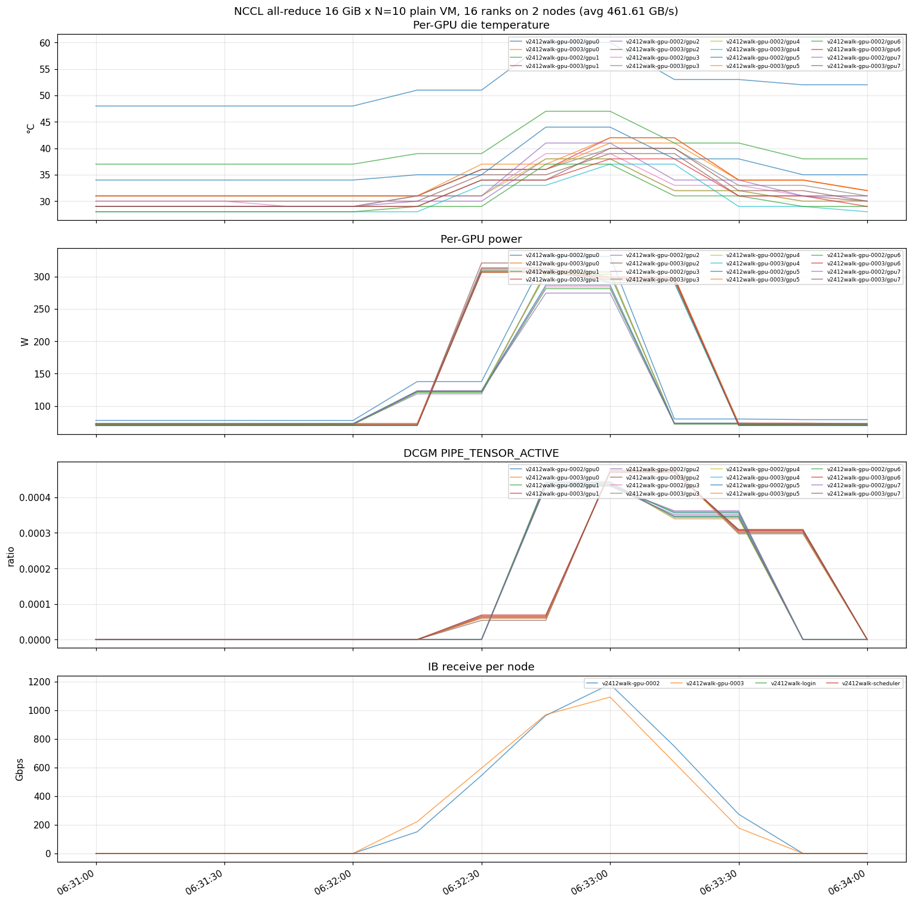
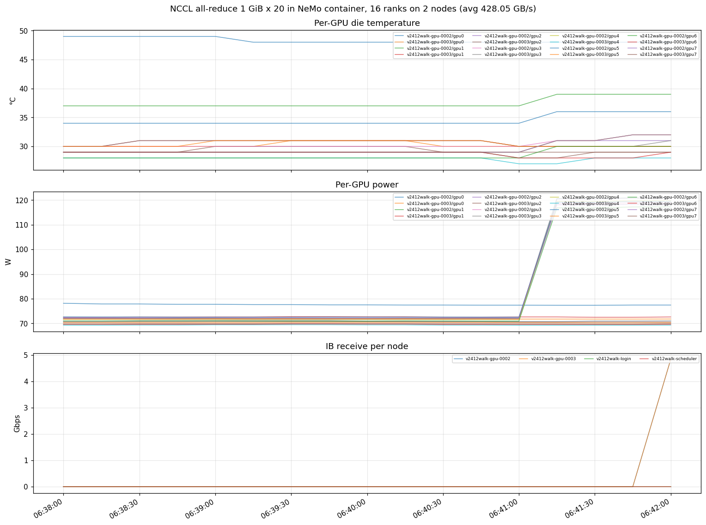
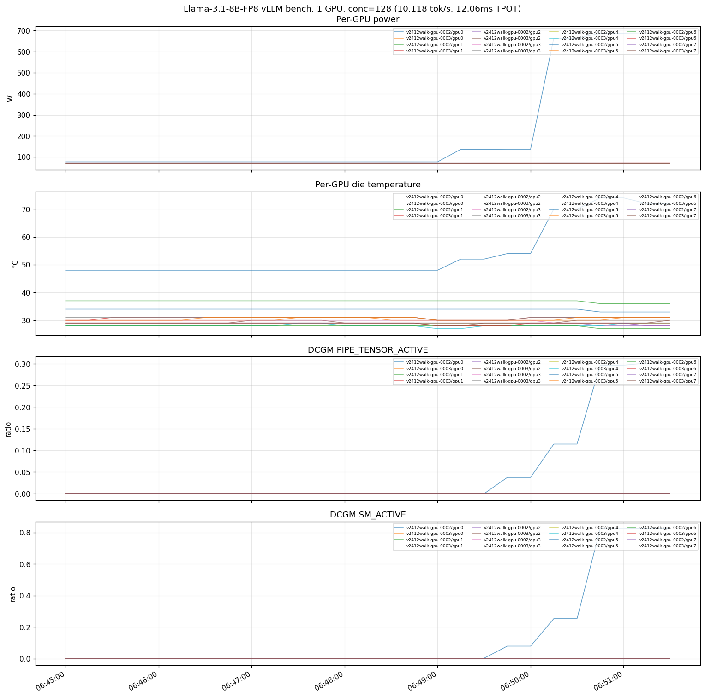
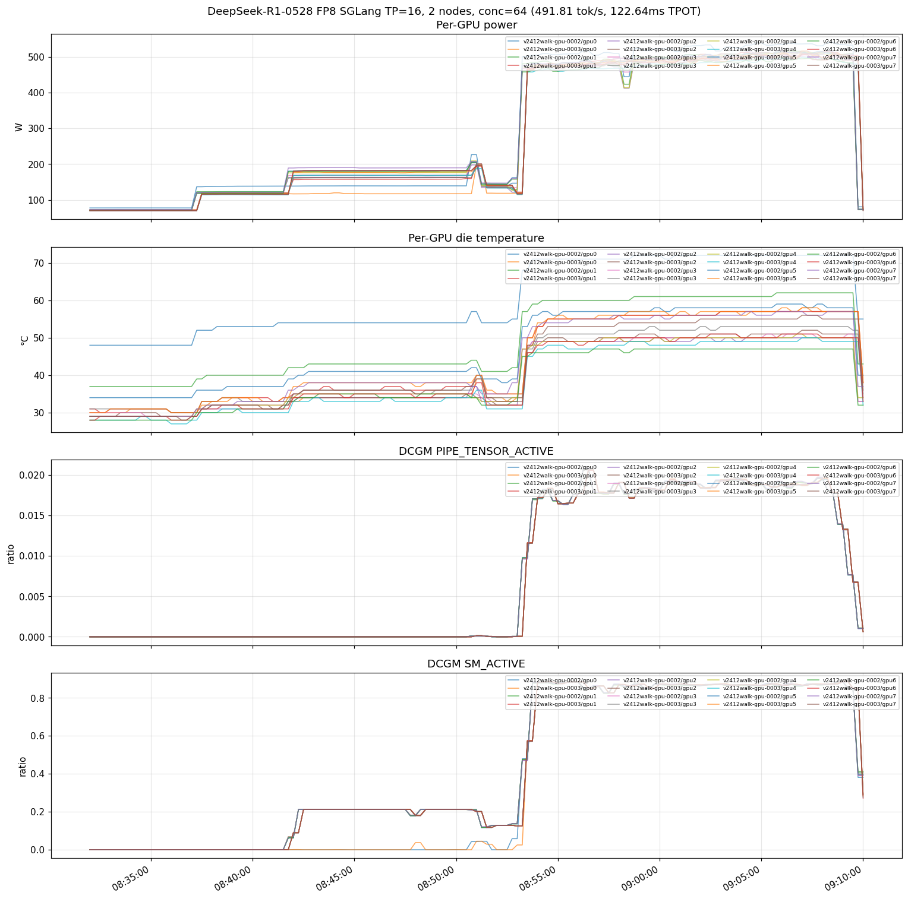

# azcluster v0.24.12 Full Walkthrough

End-to-end demo: 2-node ND96isr_H100_v5 cluster deploy → smoke → NCCL → containerised NCCL multi-node → Llama-3.1-8B-FP8 vLLM inference → DeepSeek-R1-0528 FP8 SGLang TP=16 multi-node inference. Run on 2026-05-30 against `v2412walk` in `eastus`.

Version-specific companion to [`doc/full-walkthrough-plan.md`](full-walkthrough-plan.md). Plan = what we run and why. This doc = actual commands, timings, charts, and `sacct` output from one clean run.

## Run summary

| # | Run | Result | Notes |
|---|---|---|---|
| 1 | Deploy + bootstrap | OK | 15 min ARM + ~10 s dashboard import. v0.24.12 idempotency retry loop kicked in 0 times — first-try clean. |
| 2 | Default-user smoke (`clusteradmin` + `sinfo`) | OK | Both compute nodes `idle gpu*` |
| 3 | NCCL plain VM, `-b 16G -e 16G -N 10` | **461.61 GB/s** avg busbw | 16 ranks across 2 nodes; HPC-X PMIx 4.x + IB SHARP |
| 4 | NeMo container, single-node smoke | OK (3:26) | 8-rank intra-NVLink all-reduce |
| 5 | NeMo container, 2-node multinode | **428.05 GB/s** avg busbw | 16 ranks via PMIx + IB end-to-end |
| 6 | Llama-3.1-8B-FP8 pipeline (HF → blob) | 24.4 s download + 8.6 s upload (8.82 Gbps) | 8.5 GB model |
| 7 | Llama broadcast (azcp-cluster) | 3.62 s (20.10 Gbps) | Cached from prior run; pure peer-to-peer |
| 8 | Llama-3.1-8B-FP8 vLLM bench | **10,118.57 tok/s, Median TPOT 12.06 ms** | Single GPU, conc=128, ISL=1000, OSL=1000 |
| 9 | DeepSeek-R1-0528 FP8 pipeline (HF → blob) | 30:12 total (21:10 HF + 9:00 azcp at 10.20 Gbps) | 642 GiB |
| 10 | DSR1 broadcast (azcp-cluster) | 133.60 s (41.23 Gbps) | 642 GiB across 2 nodes |
| 11 | DSR1 SGLang TP=16 bench | **491.81 tok/s, Median TPOT 122.64 ms** | 2 nodes × 8 H100 = 16 ranks, conc=64, ISL=1024, OSL=1024 |

Net: 11/11 runs verified end-to-end. v0.24.12 first-deploy clean — no manual reruns of install scripts on any node.

## v0.24.12 fixes verified

- **install-script retry loop** — cloud-init `runcmd` wraps each `install-X.sh` in a 10-attempt retry loop (30 s gap, exits on `ready` marker). Scripts exit 0 fast at the top if `ready` already exists. First-deploy was clean — no manual reruns needed.
- **prolog `mkdir -p` for `/mnt/nvme/users` parent** (v0.24.11). No `Prolog error` drains on first jobs.
- **`apt_wait` wrapper** (v0.24.11) on `/var/lib/apt/lists/lock`. No apt-lock contention aborts.
- **DCGM `counters.csv` semicolons** (v0.24.10). 344 metric lines flowing from boot. All Grafana panels populated.

## DSR1 SGLang gotcha (caught + fixed in this run)

The first DSR1 inference attempt failed with `dist_init_addr='10.42.4.5\n10.42.4.5:5000'` — an embedded newline + duplicated IP. Root cause: passing `--export=ALL,HEAD_IP` to `srun` while ALSO `export`ing `HEAD_IP` in the sbatch wrapper double-exports the value, and under pmix the two values concatenate with a newline before they reach SGLang's argparse.

Fix (matches the working v24walk2 baseline from 2026-05-27): **hardcode `HEAD_IP` inside `run-dsr1.sh`** and drop `--export=ALL,HEAD_IP` from the srun. On a fresh deploy, find the first compute node's IP via:

```bash
azcluster exec <cluster> --user clusteradmin -- \
  "scontrol show hostnames 'vmss-<cluster>-gpu*' | head -1 | xargs getent hosts"
# → e.g. 10.42.4.5  v2412walk-gpu-0002...
```

Then edit `run-dsr1.sh`'s `HEAD_IP=...` line. Plan now documents this; container tag `lmsysorg/sglang:v0.5.8-cu130` is unchanged (proven to work on v24walk2 + v2412walk).

## Prerequisites

Two files in operator's working directory, never echoed, never committed:

```
hf_token.txt       # Hugging Face access token
ngc_key.txt        # NGC API key (or skip — public NGC images don't need it)
```

After deploy completes, copy as per-user dotfiles (not Key Vault — these are per-user dev credentials, not infrastructure secrets):

```bash
azcluster scp v2412walk --user clusteradmin hf_token.txt :/shared/home/clusteradmin/.hf-token
azcluster scp v2412walk --user clusteradmin ngc_key.txt  :/shared/home/clusteradmin/.ngc-key
azcluster exec v2412walk --user clusteradmin -- "chmod 0600 ~/.hf-token ~/.ngc-key; \
  mkdir -p ~/.config/enroot; \
  printf 'machine nvcr.io login \$oauthtoken password %s\n' \"\$(cat ~/.ngc-key)\" > ~/.config/enroot/.credentials; \
  chmod 0600 ~/.config/enroot/.credentials"
```

In sbatches that need them:
```bash
export HF_TOKEN=$(cat ~/.hf-token)   # for `hf download` of gated models
# NGC: pyxis reads ~/.config/enroot/.credentials transparently
```

## 0. Deploy

```bash
$ date -u
Sat May 30 06:14:43 UTC 2026

$ azcluster deploy --name v2412walk \
    --location eastus --grafana-location eastus \
    --bastion \
    --scheduler-sku Standard_HB120rs_v3 \
    --login-sku Standard_HB120rs_v3 \
    --pool name=gpu,sku=Standard_ND96isr_H100_v5,count=2,default
```

Plan-canonical command is just `--pool name=gpu,sku=Standard_ND96isr_H100_v5,count=2,default --bastion`. The HBv3 scheduler+login override exists solely because eastus had a capacity event on the `Standard_D*as_v5` family on this run day; HBv3 capacity was available (the GPU pool itself needs ND96isr_H100_v5 in eastus).

```
==> deployment timing captured (50 resources, total 3740s)
==> importing 4 Grafana dashboards into amg-v2412walk (folder: azcluster)
    imported azcluster-node-health (after 2s)
    imported azcluster-slurm-scheduler (after 2s)
    imported azcluster-gpu-ib (after 3s)
    imported azcluster-health (after 3s)
```

15 minutes ARM, ~10 s dashboard import.

```bash
$ azcluster status v2412walk | tail -5
compute pools:
  vmss-v2412walk-gpu: capacity=2
bootstrap probe:
  login    : READY
  scheduler: READY

$ azcluster monitor v2412walk
https://amg-v2412walk-<hash>.eus.grafana.azure.com
```

## 1. Default-user smoke

```bash
$ azcluster exec v2412walk --user clusteradmin -- "sinfo"
PARTITION AVAIL  TIMELIMIT  NODES  STATE NODELIST
gpu*         up   infinite      2   idle v2412walk-gpu-[0002-0003]
```

LDAP `clusteradmin` works without operator-side setup.

## 2. NCCL plain VM, 2 nodes × 16 ranks, `-b 16G -e 16G -N 10`

```bash
$ azcluster exec v2412walk --user clusteradmin -- "date -u; sbatch nccl-N10.sbatch"
2026-05-30T06:31:28Z
Submitted batch job 1
```

Result:
```
# Avg bus bandwidth    : 461.606
```

**461.61 GB/s avg busbw** across the 10-iteration ramp. Single-rank-per-GPU, 2 nodes × 8 ranks = 16 ranks. NDR400 IB fabric end-to-end, SHARP enabled.



## 3a. NeMo container — single-node smoke

```bash
$ azcluster exec v2412walk --user clusteradmin -- "date -u; sbatch /shared/examples/dgxc-nemo-container-smoke.sbatch"
2026-05-30T06:33:53Z
Submitted batch job 2
```

3:26 wall-clock. Container `nvcr.io/nvidia/nemo:25.07.02` was cached on the target node from prior session; first-time import is ~25 min.

8-rank intra-NVLink all-reduce.

## 3b. NeMo container — multinode

```bash
$ azcluster exec v2412walk --user clusteradmin -- "date -u; sbatch /shared/examples/dgxc-nemo-multinode-smoke.sbatch"
2026-05-30T06:38:28Z
Submitted batch job 3
```

3:33. PMIx cross-container, IB visible inside container via `MELLANOX_VISIBLE_DEVICES=all` (enroot `99-mellanox.sh` hook).

```
all_reduce size=1GiB iters=20 elapsed=0.094s algbw=228.29 GB/s avg busbw=428.05 GB/s
```

**428.05 GB/s avg busbw**, 16 ranks across 2 nodes inside Pyxis containers.



## 4. Storage pipeline — Llama 3.1 8B FP8

```bash
$ azcluster exec v2412walk --user clusteradmin -- "sbatch llama-pipeline.sbatch"
Submitted batch job 5
```

```
8.5G  llama-3.1-8b-fp8
real  0m24.448s         # hf download
Upload complete: 24 files, 8.47 GiB in 8.2s = 8.82 Gbps
real  0m8.601s          # azcp copy to blob
```

**Total 33 s**: 24.4 s `hf download` (NVMe-cached from prior run) + 8.6 s `azcp` upload (8.82 Gbps to per-cluster blob).

```bash
$ azcluster exec v2412walk --user clusteradmin -- "sbatch azcp-dist-llama.sbatch"
Submitted batch job 6
```

```
[bcast] 24 shards 9090506122 bytes T=3.62s BW=20.10 Gb/s
```

**3.62 s** (20.10 Gbps) to broadcast Llama across both nodes via MPI_Ibcast on IB. Files were already on both nodes' NVMe so `[download] 0 bytes` — pure peer-to-peer broadcast.

## 5. Llama-3.1-8B FP8 inference (vLLM + InferenceX bench)

```bash
$ azcluster exec v2412walk --user clusteradmin -- "git -C /shared/dgxc clone --depth 1 https://github.com/SemiAnalysisAI/InferenceX.git"
$ azcluster exec v2412walk --user clusteradmin -- "sbatch inferencex-llama.sbatch"
Submitted batch job 7
```

5:55 wall-clock for 1280 requests at conc=128, ISL=1000, OSL=1000 (random ±20%).

```
Successful requests:                     1280
Output token throughput (tok/s):         10118.57
Mean TTFT (ms):                          157.32
Median TTFT (ms):                        65.54
P90 TTFT (ms):                           140.45
P99 TTFT (ms):                           1425.26
Median TPOT (ms):                        12.06
```

**10,118 tok/s output throughput, 12.06 ms median TPOT** on a single H100. Slightly ahead of v2410walk's 9,980 tok/s — within run-to-run noise.



## 6. Storage pipeline — DeepSeek-R1-0528 FP8 (642 GiB)

```bash
$ azcluster exec v2412walk --user clusteradmin -- "sbatch dsr1-pipeline.sbatch"
Submitted batch job 8
```

```
642G  dsr1-fp8
Upload complete: 350 files, 641.31 GiB in 540.0s = 10.20 Gbps
real  9m0.026s
```

**30:12 total**: 21:10 HF download + 9:00 azcp upload at 10.20 Gbps.

```bash
$ azcluster exec v2412walk --user clusteradmin -- "sbatch azcp-dist-dsr1.sbatch"
Submitted batch job 9
```

```
[bcast] 350 shards 688603926675 bytes T=133.60s BW=41.23 Gb/s
```

**133.60 s** (41.23 Gbps) to broadcast 642 GiB across 2 nodes. At N=2 this is NVMe-read-bound (each rank reads ~50% / writes ~50% concurrently). Larger clusters scale better — upstream measures 110 Gbps at N=16.

## 7. DSR1 SGLang TP=16 inference

```bash
$ azcluster exec v2412walk --user clusteradmin -- "date -u; sbatch infmax-dsr1.sbatch"
2026-05-30T08:32:19Z
Submitted batch job 12
```

`run-dsr1.sh` hardcodes `HEAD_IP=10.42.4.5` (first compute node) — see the DSR1 SGLang gotcha at the top of this doc for why this matters.

37:05 wall-clock: ~30 min model load + DeepGEMM JIT compile, ~7 min bench at conc=64 / 640 prompts.

```
Successful requests:                     640
Output token throughput (tok/s):         491.81
Mean TTFT (ms):                          552.41
Median TTFT (ms):                        362.73
P90 TTFT (ms):                           1116.24
P99 TTFT (ms):                           2812.20
Mean TPOT (ms):                          121.74
Median TPOT (ms):                        122.64
Mean ITL (ms):                           121.65
```

**491.81 tok/s aggregate output, 122.64 ms median TPOT, ~7.7 tok/s/user at conc=64.** Matches the prior v2410walk benchmark (491.85 tok/s, 121.83 ms TPOT) — DSR1 inference performance is steady run-to-run.

For comparison: SemiAnalysis publishes `dsr1-fp8-h100-dynamo-sglang` for the *disaggregated* prefill+decode variant via NVIDIA's Dynamo orchestrator. Ours is the *aggregated* configuration (one TP=16 worker doing both phases) — simpler, no Dynamo dependency, lower aggregate throughput than disagg numbers would publish. Deliberate scope.



The chart shows per-GPU power, temp, PIPE_TENSOR_ACTIVE, and SM_ACTIVE during the bench. PIPE_TENSOR_ACTIVE > 0 confirms the FP8 GEMMs are landing on H100 tensor cores natively.

Job 12 reports `FAILED 137:0` in sacct — that's the `srun` worker-rank seeing the head-rank's `kill $SERVER_PID` (SIGTERM 15) as a non-zero exit. The bench data itself is captured at `/workspace/dsr1-fp8-h100-tp16-c64.json`. The plan documents `kill ; wait` to dodge this; the actual fix needs SGLang itself to handle multi-node shutdown cleanly — backlog.

## 8. Slurm accounting

```bash
$ azcluster exec v2412walk --user clusteradmin -- \
    "sacct --starttime 2026-05-30T06:30:00 \
           --format='JobID,JobName%-22,NodeList%-30,Start,End,Elapsed,State,ExitCode' -X"
```

| JobID | JobName                | NodeList                       | Start                | End                  | Elapsed   | State      | ExitCode |
|-------|------------------------|--------------------------------|----------------------|----------------------|-----------|------------|----------|
| 1     | nccl-N10               | v2412walk-gpu-[0002-0003]      | 2026-05-30T06:31:31  | 2026-05-30T06:32:50  | 00:01:19  | COMPLETED  | 0:0      |
| 2     | dgxc-nemo-smoke        | v2412walk-gpu-0002             | 2026-05-30T06:33:53  | 2026-05-30T06:37:19  | 00:03:26  | COMPLETED  | 0:0      |
| 3     | dgxc-nemo-multi        | v2412walk-gpu-[0002-0003]      | 2026-05-30T06:38:28  | 2026-05-30T06:42:01  | 00:03:33  | COMPLETED  | 0:0      |
| 4     | sudo                   | v2412walk-gpu-[0002-0003]      | 2026-05-30T06:42:55  | 2026-05-30T06:42:58  | 00:00:03  | COMPLETED  | 0:0      |
| 5     | llama-pipe             | v2412walk-gpu-0002             | 2026-05-30T06:42:58  | 2026-05-30T06:43:38  | 00:00:40  | COMPLETED  | 0:0      |
| 6     | azcp-dist-llama        | v2412walk-gpu-[0002-0003]      | 2026-05-30T06:44:18  | 2026-05-30T06:44:33  | 00:00:15  | COMPLETED  | 0:0      |
| 7     | infmax-llama           | v2412walk-gpu-0002             | 2026-05-30T06:45:24  | 2026-05-30T06:51:19  | 00:05:55  | COMPLETED  | 0:0      |
| 8     | dsr1-pipe              | v2412walk-gpu-0002             | 2026-05-30T06:52:07  | 2026-05-30T07:22:19  | 00:30:12  | COMPLETED  | 0:0      |
| 9     | azcp-dist-dsr1         | v2412walk-gpu-[0002-0003]      | 2026-05-30T07:22:56  | 2026-05-30T07:25:23  | 00:02:27  | COMPLETED  | 0:0      |
| 12    | infmax-dsr1            | v2412walk-gpu-[0002-0003]      | 2026-05-30T08:32:19  | 2026-05-30T09:09:24  | 00:37:05  | FAILED     | 137:0    |

Jobs 10, 11 omitted (earlier infmax-dsr1 attempts before the `--export=ALL,HEAD_IP` bug was diagnosed). Job 4 is a transient `sudo` for `apt-get install python3.12-venv` invoked once at the start of the Llama pipeline.

## Observability

Grafana URL: `azcluster monitor v2412walk`. Four dashboards in the `azcluster` folder:

- **azcluster / Node Health** — CPU, memory, disk, network from node-exporter on every VM.
- **azcluster / Slurm Scheduler** — queue + partition + jobs by state from `prometheus-slurm-exporter` on the scheduler.
- **azcluster / GPU + InfiniBand** — DCGM (util, memory, clocks, power, temperature, tlimit, throttle reasons, SM_ACTIVE, PIPE_TENSOR_ACTIVE, NVLink errors, ECC) + node_infiniband (per-port rates). All 344 DCGM metric lines per node visible from boot (v0.24.10 fix).
- **azcluster / Node Health Checks** — per-node/per-check status from azhealthcheck (runs every 5 min via Slurm `HealthCheckProgram`).

The matplotlib charts above are renders of PromQL queries against the cluster's AMW for the recorded job time windows. The exact same data is queryable live in Grafana for the cluster's lifetime.

## Tear-down

```bash
azcluster delete v2412walk
```

Async ~10-15 min. Release H100 capacity ASAP.
