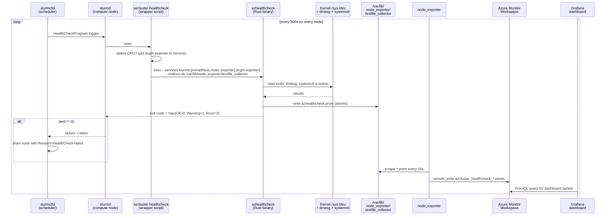
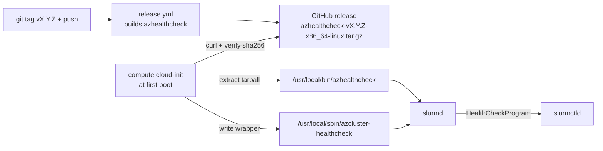

# Node Health Checks

How azcluster keeps a broken compute node out of the scheduling pool — automatically, every 5 minutes, with no daemon.

## TL;DR

A small static Rust binary (`azhealthcheck`) runs on every compute node every 5 minutes via Slurm's `HealthCheckProgram` hook. It runs five cheap, dependency-free checks (GPU count, GPU Xid scan, network interfaces, kernel critical messages, systemd unit status). If any check returns `Error`, the binary exits non-zero and `slurmctld` drains the node automatically. The same run also writes Prometheus exposition files into node-exporter's textfile-collector directory, so the same status surfaces in Grafana under the **Node Health Checks** dashboard — without an extra service.



## Why this shape

- **Slurm already has the hook.** `HealthCheckProgram=<path>` + `HealthCheckInterval=300` + `HealthCheckNodeState=ANY,CYCLE` is the standard Slurm contract — non-zero exit drains. No need to invent a parallel notification path or stand up a daemon.
- **One-shot exec, no daemon.** Nothing to keep alive, nothing to monitor, no socket. The cost of a missed run is "the next run, 5 min later".
- **Static binary, no runtime deps.** Pure Rust + libstd. No DCGM, no `nvidia-smi`, no Python. Anything we can read from `/sys`, `/dev`, or `dmesg --level=...` we read directly. The checks survive even when GPU userspace is wedged.
- **Severity → exit code is the only IPC with Slurm.** Mapping is `Ok=0`, `Warning=1`, `Error=2`. Slurm treats 1 and 2 identically (drain), but the split lets us extend later (e.g. warning → log only via wrapper).
- **Skip-by-default for missing units.** The `systemd` check treats `unit not found` as `missing` (silently skipped), not `failed`. Lets us ship a single global service list (`slurmd,prometheus,node_exporter,dcgm-exporter`) that works on both CPU and GPU nodes — `dcgm-exporter` is simply absent on CPU nodes and the check stays green. The wrapper script also auto-trims `dcgm-exporter` when `nvidia-smi` reports no GPUs, as belt-and-braces.
- **Dual output: exit code AND Prometheus textfile.** Slurm sees the exit code (drain decision). Operators see the same data in Grafana via node-exporter's textfile collector — no extra service, no separate scrape config.

## The five checks

All implemented in `crates/azhealthcheck/src/checks.rs`. Each returns a `CheckOutcome { name, severity, message, findings }`.

### `gpu_count` — driver vs PCI sanity

Walks `/sys/bus/pci/devices/*`, counts entries whose `vendor == 0x10de` (NVIDIA) **and** whose `class` starts with `0x0300` or `0x0302` (display / 3D controller). Then counts `/dev/nvidia<N>` device nodes. The two numbers must match.

| Outcome | Condition |
|---|---|
| `Ok` | both counts are 0 (CPU node) |
| `Ok` | counts match and > 0 |
| `Error` | counts differ (e.g. PCI sees 8 GPUs, `/dev` sees 6 → driver lost two) |

Catches the common NDv5 failure where the driver enumerates fewer GPUs than the PCI fabric exposes. The check is sysfs-only — no `nvidia-smi` shell-out, so it works even when userspace is hung.

### `gpu_xid` — fatal-Xid scan

Runs `dmesg --time-format=iso`, scans for `NVRM: Xid`, parses out the Xid number. Each Xid is classified:

| Xid set | Classification | Action |
|---|---|---|
| `{48, 61, 62, 63, 64, 74, 79, 94, 95}` | **Fatal** — MMU fault, GSP-RM error, contained ECC, GPU off the bus, NVLink error, uncontained ECC | `Error` → drain |
| `{43, 45}` | **Soft** — SW-induced GPU reset, preemptive cleanup (often user-job OOM) | `Warning` → log only |
| Anything else | Treated as Error (conservative; XIDs are rare in steady state) | `Error` → drain |

The fatal list is the conservative subset of NVIDIA's published Xid catalogue — every entry is on NVIDIA's own "node should be drained" list.

### `network` — interface up + flap detection

Walks `/sys/class/net/*`, skipping `lo`, `docker*`, `veth*`. Keeps only `type == 1` (Ethernet) or `type == 32` (InfiniBand). For each survivor:

- `operstate` must be `up` (else `Error`)
- `carrier` must be `1` (else `Error`)
- If `operstate == up` and `carrier_down_count >= 2`, emits `Warning` ("flapped") — a NIC that has flapped at least twice since boot is suspicious even if currently up

Threshold is `>= 2` rather than `> 0` because Azure accelerated networking always shows one boot-time carrier transition (basic NIC → SR-IOV VF), so the `>= 2` filter rules out the benign single-flap noise. See AGENTS.md v0.24.5 gotcha.

On NDv5 this validates all 8 `mlx5_ib*` IB ports plus `eth0` in one pass.

### `kmsg` — kernel critical messages

Runs `journalctl --dmesg --no-pager --since "1 hour ago"` (was `dmesg --level=...` pre-v0.24.5; switched to `journalctl --dmesg` because raw `dmesg` requires root or `CAP_SYSLOG`, but `journalctl` respects journald's group-based ACL so it works for any user in the `systemd-journal` group). Filters for severity `emerg`, `alert`, `crit`. Any non-empty line is an `Error` finding.

The 1-hour window is the healthcheck interval × 12 — long enough to catch issues that surfaced between two checks, not so long that ancient events get re-reported for hours.

Catches `Hardware error from APEI`, `mce: [Hardware Error]`, `EDAC ... uncorrectable error`, NVMe controller resets — anything the kernel itself considers critical.

### `systemd` — service liveness

For each service name in `--services`, runs `systemctl is-active <svc>` and bucketises:

| `is-active` says | Bucket | Effect |
|---|---|---|
| `active` | active | counts toward green |
| `failed` | failed | `Error` |
| `inactive` / `activating` / `deactivating` / `reloading` | inactive | `Warning` |
| `unknown` | missing | silently skipped |

Default service list assembled by the wrapper script:

- `slurmd` — must be running, else the node can't take jobs
- `prometheus` — local per-node Prometheus that scrapes node-exporter + dcgm-exporter and remote-writes to AMW
- `node_exporter` — host metrics + textfile collector for our `azhealthcheck.prom`
- `dcgm-exporter` — GPU metrics (auto-added by the wrapper when `nvidia-smi -L` reports at least one GPU)

## Severity → exit code

```rust
// crates/azhealthcheck/src/types.rs
pub enum Severity { Ok, Warning, Error }

impl Severity {
    pub fn exit_code(self) -> i32 {
        match self {
            Severity::Ok      => 0,
            Severity::Warning => 1,
            Severity::Error   => 2,
        }
    }
}
```

The binary takes the **max** severity across all check outcomes and exits with that. Slurm treats any non-zero exit as a drain trigger, but keeping `Warning ≠ Error` leaves the door open for "log but don't drain" behaviour (would need a wrapper that masks exit 1 → 0).

## Prometheus metrics surface

When `--metrics-dir <path>` is passed (the wrapper always passes `/var/lib/node_exporter/textfile_collector`), the binary writes a file `azhealthcheck.prom` atomically into that directory after every run. node-exporter's textfile collector scrapes every `*.prom` in that directory on each Prometheus scrape, so the data flows through node-exporter → local Prometheus → AMW remote-write → Grafana with **zero additional scrape configuration**.

Four series are emitted (all labelled `host=<hostname>`):

| Metric | Type | Labels | Value |
|---|---|---|---|
| `azcluster_healthcheck_severity` | gauge | `check`, `host` | per-check: 0=Ok, 1=Warning, 2=Error |
| `azcluster_healthcheck_findings_total` | gauge | `check`, `host` | per-check: number of findings emitted on this run |
| `azcluster_healthcheck_worst_severity` | gauge | `host` | max severity across all checks |
| `azcluster_healthcheck_last_run_timestamp_seconds` | gauge | `host` | unix time of this run (lets Grafana detect a stale healthcheck process) |

The shipped Grafana dashboard `azcluster / Node Health Checks` builds on these:

- **Worst severity per node** — `max by (host) (azcluster_healthcheck_worst_severity)`
- **Per-check status heatmap** — `azcluster_healthcheck_severity` with `check` on the y-axis and `host` on the x-axis
- **Findings count per check** — `azcluster_healthcheck_findings_total > 0`
- **Healthcheck staleness** — `time() - azcluster_healthcheck_last_run_timestamp_seconds` (highlights nodes where the check has stopped running)

Useful ad-hoc queries:

```promql
# Which check on which node is currently failing?
azcluster_healthcheck_severity == 2

# How long since the last healthcheck on each node?
time() - max by (host) (azcluster_healthcheck_last_run_timestamp_seconds)

# Rolling count of fatal Xid findings in the last hour
sum by (host) (max_over_time(azcluster_healthcheck_findings_total{check="gpu_xid"}[1h]))
```

## Slurm wiring

In `cloud-init/scheduler.yaml.tmpl` (written into `/etc/slurm/slurm.conf` and distributed to every compute node via Slurm configless mode):

```
HealthCheckProgram=/usr/local/sbin/azcluster-healthcheck
HealthCheckInterval=300
HealthCheckNodeState=ANY,CYCLE
```

- `Interval=300` — every 5 minutes
- `NodeState=ANY,CYCLE` — run on any node state (idle, allocated, drained, down) and cycle through nodes so the load doesn't spike. Crucially this includes `ALLOCATED` nodes, so a GPU that goes bad mid-job is caught without waiting for the job to finish.

## Wrapper script

Slurm's `HealthCheckProgram` takes a single absolute path, not a command line. The wrapper assembles the service list (auto-detecting GPUs) and adds the metrics-dir flag so `slurm.conf` stays static across CPU and GPU nodes. Written by cloud-init to `/usr/local/sbin/azcluster-healthcheck`:

```bash
#!/bin/bash
SERVICES="slurmd,prometheus,node_exporter"
if command -v nvidia-smi >/dev/null 2>&1 && nvidia-smi -L 2>/dev/null | grep -qE '^GPU [0-9]+:'; then
  SERVICES="${SERVICES},dcgm-exporter"
fi
exec /usr/local/bin/azhealthcheck \
  --services "${SERVICES}" \
  --metrics-dir /var/lib/node_exporter/textfile_collector \
  "$@"
```

The `microsoft-dsvm:ubuntu-hpc` image ships `nvidia-smi` even on CPU SKUs, so the GPU presence check uses `nvidia-smi -L | grep -cE '^GPU [0-9]+:'` rather than `command -v nvidia-smi`.

## Manual invocation

On a compute node:

```bash
# What slurmctld sees by default (human-readable, all 5 checks):
sudo /usr/local/sbin/azcluster-healthcheck

# JSON for log scraping or post-mortem:
sudo /usr/local/bin/azhealthcheck --json --services slurmd,prometheus,node_exporter

# Just one check (e.g. probe for Xid events without touching anything else):
sudo /usr/local/bin/azhealthcheck --checks gpu_xid

# Check exit code matches severity:
sudo /usr/local/sbin/azcluster-healthcheck; echo "exit=$?"
```

Sample human output (green):

```
OK    gpu_count: 8 GPUs visible
OK    gpu_xid: no Xid events in kernel log
OK    network: 9 interface(s) up: eth0,mlx5_ib0,mlx5_ib1,mlx5_ib2,mlx5_ib3,mlx5_ib4,mlx5_ib5,mlx5_ib6,mlx5_ib7
OK    kmsg: no critical kernel messages in last hour
OK    systemd: 4 service(s) active
```

Sample failure output (one fatal Xid → drain):

```
OK    gpu_count: 8 GPUs visible
ERROR gpu_xid: 1 fatal Xid event(s) in kernel log
        - Xid 79: 2026-05-23T14:22:11 NVRM: Xid (PCI:0000:b1:00): 79, pid=12345, GPU has fallen off the bus
OK    network: 9 interface(s) up: ...
OK    kmsg: no critical kernel messages in last hour
OK    systemd: 4 service(s) active
```

Exit code: 2. `slurmctld` logs the stderr + exit code and drains the node with `Reason=HealthCheck failed` (visible in `scontrol show node <name>`).

## Recovering a drained node

After fixing the underlying issue (e.g. rebooting to clear an Xid 79), the operator must `scontrol update nodename=<n> state=resume` from the scheduler. The healthcheck does **not** auto-undrain — that's intentional, because a fatal Xid usually warrants operator review even after the symptom clears.

```bash
azcluster ssh <cluster> --user clusteradmin
# Inspect why it drained:
scontrol show node <node> | grep -E 'State|Reason'

# After fix:
sudo scontrol update nodename=<node> state=resume
```

## Release & install



## What's intentionally not in scope

These were considered and deferred:

- **DCGM-backed checks** (`gpu_dcgm`, `gpu_nvlink`) — NVLink CRC errors, thermal throttle, ECC events. Needs either libdcgm FFI or a `nvidia-smi -q` parser. The current checks catch hard failures; DCGM would catch slow degradation. Backlog.
- **Intrusive diagnostics** (`gpu_diag`) — NCCL p2p ring tests, IB loopback, etc. Too expensive every 5 min on an allocated node — would interfere with the user's job. Belongs to a separate `azcluster diag` operator command, not the periodic health check.
- **Azure GHR (GPU Health Report) integration** — would let us call the Azure-side health API and surface platform-reported issues (e.g. node marked unhealthy by Azure's own telemetry pipeline). Could be added as a sixth check that polls IMDS or the Azure API via the node's UAI.
- **Self-undrain on recovery** — see above; intentional.

## Code map

| File | Role |
|---|---|
| `crates/azhealthcheck/Cargo.toml` | Crate manifest. Deps: `anyhow`, `clap`, `serde`, `serde_json`. Dev-dep: `tempfile`. |
| `crates/azhealthcheck/src/main.rs` | Clap CLI, dispatch table, JSON-vs-human output, exit-code computation, metrics file write |
| `crates/azhealthcheck/src/types.rs` | `Severity`, `CheckOutcome`, `Runner` trait, `RealRunner`, `FakeRunner` (test only) |
| `crates/azhealthcheck/src/checks.rs` | The 5 check functions + unit tests |
| `crates/azhealthcheck/src/metrics.rs` | Prometheus exposition rendering + atomic write |
| `cloud-init/compute.yaml.tmpl` | Downloads release tarball, installs binary, writes wrapper script, creates `/var/lib/node_exporter/textfile_collector` |
| `cloud-init/scheduler.yaml.tmpl` | Sets `HealthCheckProgram`, `HealthCheckInterval`, `HealthCheckNodeState` in `slurm.conf` |
| `grafana/dashboards/health.json` | Node Health Checks dashboard, auto-imported into AMG post-deploy |
| `.github/workflows/release.yml` | Builds + uploads `azhealthcheck-vX.Y.Z-x86_64-linux.tar.gz` on tag |

## Adding a new check

1. Add `pub fn my_check(runner: &dyn Runner, ...) -> CheckOutcome` in `crates/azhealthcheck/src/checks.rs`. Use `Runner` (not `Command::new` directly) for anything that shells out, so it's testable with `FakeRunner`.
2. Add it to the `ALL_CHECKS` slice and the dispatch `match` in `crates/azhealthcheck/src/main.rs`.
3. Add unit tests using `FakeRunner` for shell-out paths or `tempfile` for sysfs paths.
4. Pick severity carefully: `Error` drains the node, `Warning` doesn't (yet — see "Severity → exit code"), `Ok` is silent green.
5. No new runtime deps unless absolutely necessary — the value of a static, dep-free binary is that it runs anywhere with no preconditions.
6. The metrics file is regenerated automatically — `metrics::render` enumerates every `CheckOutcome` in the slice, so a new check appears in Grafana on the next scrape with no dashboard edit needed.
